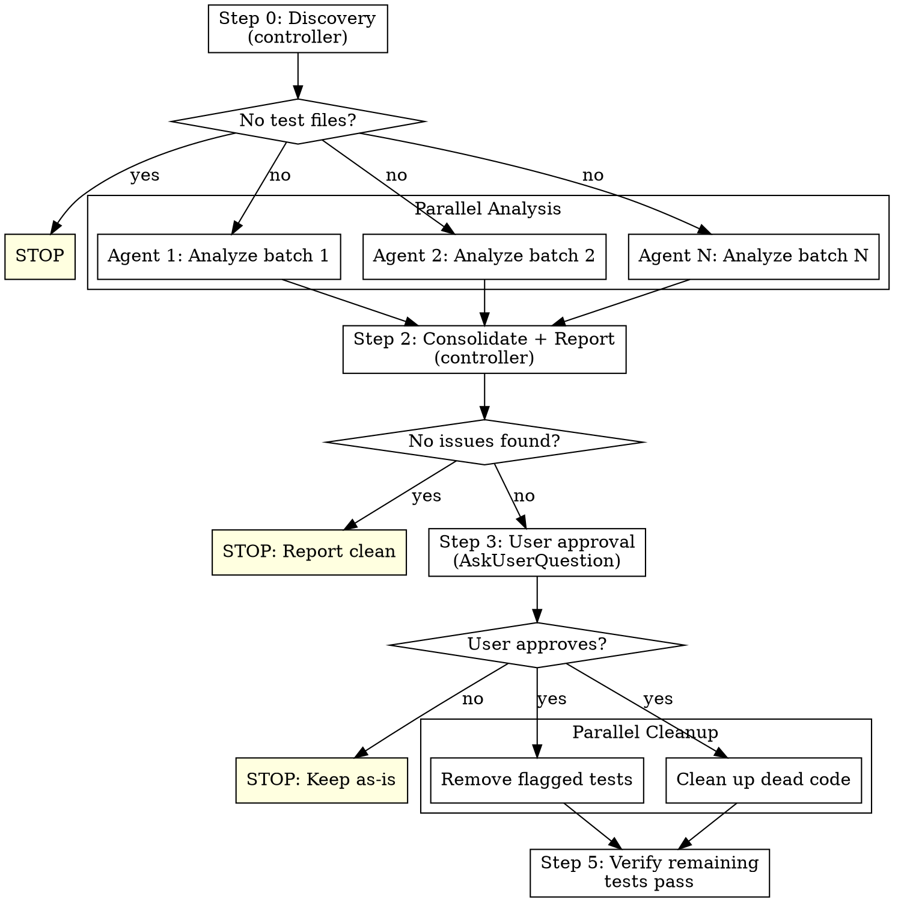

# Cleaning Tests

## Overview

Multi-agent test analysis that identifies low-value tests, presents a categorized report for user approval, and removes approved tests with cleanup of leftover dead code.

**Core principle:** A test's value is determined by whether it verifies observable behavior. Tests coupled to implementation details create maintenance burden without catching real bugs.

**Announce at start:** "I'm using the cleaning-tests skill to analyze the test suite for low-value tests."

## When to Use

- Tests frequently break when refactoring without behavior changes
- High mock count makes tests hard to maintain
- Test suite is slow and bloated
- User explicitly asks for test cleanup
- Preparing a codebase for major refactoring

## Agent Assumptions

**All tools are functional and will work without error.** Do not test tools or make exploratory calls. Every tool call should have a clear purpose. **Make this clear to every subagent you launch.**

## The Process



### Step 0: Discovery (Controller)

You (the controller) handle discovery directly. Do NOT delegate to a subagent.

1. Detect test framework: look for `jest.config.*`, `vitest.config.*`, `pytest.ini`, `pyproject.toml [tool.pytest]`, `.mocharc.*`, `karma.conf.*`, `phpunit.xml`, etc.
2. Find all test files using framework conventions (e.g., `**/*.test.{ts,js}`, `**/*.spec.{ts,js}`, `**/test_*.py`, `**/*_test.go`)
3. Count total test files and estimate scope
4. Find corresponding source files (for agents to understand what's being tested)

If no test files found → **stop** ("No test files found in the project").

### Step 1: Parallel Analysis (N Agents)

Split test files evenly among agents. Each agent receives:
- Its batch of test files to analyze
- Paths to corresponding source files
- The **Flag Criteria** from this skill (copy the full section below)

Each agent reads its assigned test files AND their corresponding source code, then returns a structured list:

```
For each flagged test:
- File path and test name (describe + it text)
- Category (from Flag Criteria below)
- Explanation: WHY this test is low-value (1-2 sentences)
- Verdict: REMOVE or BORDERLINE
```

Agents must also list tests they reviewed and classified as KEEP (just file path + test name, no explanation needed).

### Step 2: Consolidate + Report (Controller)

1. Merge findings from all agents
2. Deduplicate (same test flagged by multiple agents = one entry)
3. Count by category
4. Write report to `docs/reviews/test-cleanup-YYYY-MM-DD.md` using the template below
5. Present summary to user in terminal

### Step 3: User Approval

Use **AskUserQuestion** to present the summary and ask the user to approve. Options:
- "Remove all flagged tests" — proceed with full cleanup (only REMOVE tests are deleted, BORDERLINE tests are kept)
- "Let me choose from the borderline tests too" — show BORDERLINE tests one by one or in a list, let user decide which to also remove
- "Show me the full report" — tell user: "Full report written to `docs/reviews/test-cleanup-YYYY-MM-DD.md`", then ask again with the same options
- "Cancel" — keep everything as-is

**NEVER remove tests without explicit user approval.**

### Step 4: Parallel Cleanup (Agents)

After approval, split flagged tests among agents. Each agent:
1. Removes the flagged test cases (the `it(...)` blocks)
2. Removes empty `describe` blocks left behind
3. Removes test helper functions/fixtures only used by removed tests — **verify zero remaining usages** with grep/find-references before removing any helper
4. Removes unused imports left behind
5. Removes orphaned section comments (e.g., `// BAD TESTS` markers that no longer apply)
6. Deletes test files entirely if all their tests were removed
7. Does NOT modify any source code — only test files

### Step 5: Verify (Controller)

Run the test suite to confirm remaining tests still pass. If tests fail, investigate — likely a cleanup error (removed a shared helper that was still needed).

## Flag Criteria

Share this with every analysis agent.

### DO Flag

| Category | Signal | Example |
|----------|--------|---------|
| **Private state access** | Accessing internals via `as any`, reflection, `__private`, `@VisibleForTesting` | `(service as any).cache.get(id)` |
| **Mock call counts** | Asserting exact call counts on internal dependencies (not side effects) | `expect(repo.save).toHaveBeenCalledTimes(1)` |
| **Call ordering** | Tracking sequence of internal method calls | `expect(callOrder).toEqual(['findByEmail', 'save'])` |
| **Internal args** | Asserting exact arguments passed to internal collaborators | `expect(repo.save).toHaveBeenCalledWith(exactObj)` |
| **Log format** | Asserting exact log message strings or call counts | `expect(logger.log).toHaveBeenCalledWith('Created user 1')` |
| **Tautological** | Testing that a mock returns its configured value through a passthrough with no conditional logic or side effects | Mock returns X → assert result is X. If the code path has branching logic (even if output matches the mock), consider whether it exercises a meaningful path — classify as BORDERLINE if unsure |
| **Constant testing** | Asserting values of exported constants | `expect(MAX_LENGTH).toBe(100)` |
| **Type/existence** | Testing `typeof fn === 'function'` — always flag in typed languages (TS/Java/Go), flag in JS only if other tests already exercise the export | `expect(typeof capitalize).toBe('function')` |
| **Redundant snapshot** | Snapshot on simple deterministic output already covered by direct assertions | `toMatchInlineSnapshot` on a pure function output |
| **Redundant coverage** | Multiple tests covering the exact same code path with no new branch | Two tests for `canCancel` that both exercise the `true` branch |
| **No assertions** | Test body has no assertions or only trivially-true assertions | `it('works', () => { createThing(); })` |

### Do NOT Flag

These are legitimate tests even if they use mock assertions:

- **Critical side effects:** Verifying rollback, cleanup, or compensating actions happened (e.g., `expect(inventory.release).toHaveBeenCalled()` after payment failure)
- **External API contracts:** Asserting arguments passed to external services (payment gateways, email providers, third-party APIs) — this verifies the contract. **Heuristic:** A dependency is "external" if it crosses a system boundary (network call, filesystem, third-party service). Injected interfaces that represent in-process collaborators (repositories, caches, internal services) are "internal" even if abstracted behind an interface. When ambiguous, classify as BORDERLINE.
- **Enum boundary values:** Testing all values of a small enum for complete branch coverage — but flag if multiple tests exercise the exact same branch (e.g., two `true` cases in a boolean return)
- **Complex snapshots:** Snapshots for complex/hard-to-assert outputs (UI trees, large serialized structures)
- **Error message contracts:** When the error message IS the public API contract (e.g., user-facing error codes)
- **Any test whose removal would reduce behavior coverage**

**When in doubt, classify as BORDERLINE, not REMOVE.** False positives erode user trust.

## Report Template

```markdown
# Test Cleanup Report

**Date**: YYYY-MM-DD
**Project**: <project path>
**Test framework**: <detected framework>
**Total test files**: N
**Total tests analyzed**: N
**Tests flagged for removal**: N
**Tests flagged as borderline**: M

## Summary by Category

| Category | Count | Files Affected |
|----------|-------|----------------|
| Implementation detail: private state access | N | file1, file2 |
| Implementation detail: mock call counts | N | ... |
| ... | ... | ... |

## Flagged Tests

### <file-path>

#### REMOVE: <test name>
- **Category**: <category>
- **Why**: <1-2 sentence explanation>

#### BORDERLINE: <test name>
- **Category**: <category>
- **Why**: <explanation>
- **Note**: <why it's borderline>

## Tests Kept

<N tests across M files classified as valuable behavioral tests.>
```

## Common Mistakes

| Mistake | Fix |
|---|---|
| Removing tests without user approval | ALWAYS use AskUserQuestion before any removal |
| Flagging mock assertions that verify critical side effects | Read the DO NOT FLAG section — rollback/cleanup verification is legitimate |
| Modifying source code during cleanup | Only modify test files — source code is out of scope |
| Not running tests after cleanup | Always verify remaining tests pass in Step 5 |
| Flagging all mock-based assertions | Mock assertions are fine when verifying observable behavior or external contracts |
| Running analysis sequentially | Split test files among parallel agents for large suites |
| Removing test helpers still used by other tests | Check all usages before removing any helper/fixture |
| Flagging internal args tests when no other test verifies persistence | If removing the test would leave a gap where wrong data could be saved undetected, classify as BORDERLINE |
| Not writing the report file | Always write to `docs/reviews/test-cleanup-YYYY-MM-DD.md` |

## Red Flags

**STOP if you catch yourself:**
- Removing tests without asking the user first
- Flagging a test just because it uses mocks (mocks are a tool, not a smell)
- Modifying production/source code
- Skipping the verification step (running remaining tests)
- Being too aggressive — when in doubt, mark BORDERLINE not REMOVE
