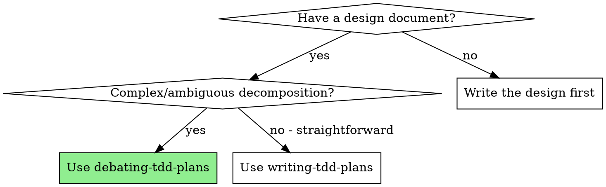

# Debating TDD Plans

## Overview

Transform a complex design document into a TDD implementation plan through structured debate among 4 specialized agents. A moderator orchestrates rounds of research, presentation, and adversarial challenge, then synthesizes the consensus into a plan.

**Core principle:** When a design has multiple valid decompositions, adversarial debate produces better plans than single-agent judgment. The debate surfaces hidden dependencies, testing gaps, and architectural tradeoffs that one agent would miss.

**Output:** Identical to writing-tdd-plans format — directly executable by executing-tdd-plans.

**Announce at start:** "I'm using the debating-tdd-plans skill to create the implementation plan through team debate."

## When to Use



**Signals for complex designs:**
- Multiple valid ways to decompose features
- Unclear dependency graph between components
- Architectural tradeoffs without obvious winners
- Large surface area with potential hidden interactions
- Design touching unfamiliar codebase areas

**When NOT to use:** Simple designs with clear feature boundaries → use writing-tdd-plans directly.

## Panelist Roles

| Role | Focus | Key Questions |
|------|-------|---------------|
| **Decomposer** | Feature decomposition, granularity, Task 0, PR boundaries, parallel safety | How should this split? Is each triplet 5-15 min? What shared infrastructure needs Task 0? Do any "independent" features modify overlapping files (must serialize or extract to Task 0)? Are there deferred items that define PR boundaries? |
| **Test Strategist** | Test coverage, integration-first testing, requirement verification, testing behavior not implementation | What does each feature need tested? Can it be tested with real services via fixtures/testcontainers? Are mocks truly unavoidable? Do tests verify behavior, not implementation details? |
| **Devil's Advocate** | Challenge everything, alternative decompositions, gaps, PR scope | What's wrong with this plan? What features were missed? What assumptions are wrong? Are deferred items properly excluded? |
| **Codebase Guardian** | Side effects, hidden dependencies, dead code, DRY, file overlap | What existing code is affected? Hidden couplings? Dead code to remove? Are we duplicating logic? Do proposed parallel features modify overlapping files (shared types, barrel exports, config)? |

## The Process

```dot
digraph process {
    rankdir=TB;

    "Read design document" [shape=box];
    "Create team + discussion log" [shape=box];
    "Spawn 4 panelists" [shape=box];

    subgraph cluster_research {
        label="Phase 1: Research (parallel)";
        "Panelists explore codebase through their lens" [shape=box];
        "Each appends findings to log" [shape=box];
        "Each messages moderator: done" [shape=box];
    }

    "All done with research?" [shape=diamond];

    subgraph cluster_present {
        label="Phase 2: Present (parallel)";
        "Broadcast: start presenting" [shape=box];
        "Read others' research, write proposals to log" [shape=box];
        "Each messages moderator: done" [shape=box, label="Each messages moderator: done presenting"];
    }

    "All presented?" [shape=diamond];

    subgraph cluster_debate {
        label="Phase 3: Debate (peer-to-peer)";
        "Broadcast: start debating" [shape=box];
        "Challenge each other via SendMessage + log" [shape=box];
        "Each messages moderator: done" [shape=box, label="Each messages moderator: done debating"];
    }

    "All done debating?" [shape=diamond];
    "Convergence?" [shape=diamond];
    "Optional extra round" [shape=box];

    subgraph cluster_synthesis {
        label="Phase 4: Synthesis";
        "Read full discussion log" [shape=box];
        "Determine PR scope" [shape=box];
        "Multiple PRs needed?" [shape=diamond];
        "Write one TDD plan" [shape=box];
        "Write separate plan per PR" [shape=box];
        "Shutdown team" [shape=box];
    }

    "Read design document" -> "Create team + discussion log";
    "Create team + discussion log" -> "Spawn 4 panelists";
    "Spawn 4 panelists" -> "Panelists explore codebase through their lens";
    "Panelists explore codebase through their lens" -> "Each appends findings to log";
    "Each appends findings to log" -> "Each messages moderator: done";
    "Each messages moderator: done" -> "All done with research?";

    "All done with research?" -> "Broadcast: start presenting" [label="yes"];

    "Broadcast: start presenting" -> "Read others' research, write proposals to log";
    "Read others' research, write proposals to log" -> "Each messages moderator: done presenting";
    "Each messages moderator: done presenting" -> "All presented?";

    "All presented?" -> "Broadcast: start debating" [label="yes"];

    "Broadcast: start debating" -> "Challenge each other via SendMessage + log";
    "Challenge each other via SendMessage + log" -> "Each messages moderator: done debating";
    "Each messages moderator: done debating" -> "All done debating?";

    "All done debating?" -> "Convergence?" [label="yes"];
    "Convergence?" -> "Read full discussion log" [label="yes"];
    "Convergence?" -> "Optional extra round" [label="no"];
    "Optional extra round" -> "Read full discussion log";

    "Read full discussion log" -> "Determine PR scope";
    "Determine PR scope" -> "Multiple PRs needed?";
    "Multiple PRs needed?" -> "Write one TDD plan" [label="no"];
    "Multiple PRs needed?" -> "Write separate plan per PR" [label="yes"];
    "Write one TDD plan" -> "Shutdown team";
    "Write separate plan per PR" -> "Shutdown team";
}
```



## Phase 0: Setup

1. Read the design document thoroughly. **Scan for PR scope signals:** look for phrases like "deferred to PR 2", "phase 2", "out of scope for initial PR", "future work", or any indication that the design spans multiple PRs or delivery phases. Note these for the panelists.
2. Create the discussion log directory and file:

```bash
mkdir -p temp/discussions
```

**Log location:** `temp/discussions/debating-{ISO-date}-{HHmmss}.md` (timestamp ensures uniqueness across runs)

**Log template:**

```markdown
# Discussion Log: {design document title}

**Team:** debating-tdd-plans
**Started:** {ISO timestamp}
**Participants:** Decomposer, Test Strategist, Devil's Advocate, Codebase Guardian
**Design Document:** {path/to/design.md}
**Question:** How should this design be decomposed into TDD triplets?
**PR Scope Signals Found:** {list any "deferred to PR 2", "phase 2", "future work" etc. found in design doc, or "None detected"}

---

## Round 0: Research

---

## Round 1: Present

---

## Round 2: Debate

---

## Consensus
```

3. Create the team with a unique name:

```
TeamCreate: team_name="debating-{short-topic}", description="Debating TDD plan for {design title}"
```

Use a short topic slug (e.g., "debating-auth-system") to avoid name conflicts across runs.

4. Spawn all 4 panelists via Task tool with the team name from step 3. Use the prompt template from `./panelist-prompt.md`, filling in:
   - Role name and focus areas
   - Design document path
   - Discussion log file path
   - Names of all other panelists

**Subagent type:** general-purpose (panelists need Read, Glob, Grep, Edit, SendMessage)

## Phase 1: Research (parallel)

All panelists work simultaneously. Each:
1. Reads the design document
2. Explores the codebase through their specialized lens
3. Appends signed findings to the log under "## Round 0: Research"
4. Messages the moderator: "Done with research"

**Message signing format:**

```markdown
### [Decomposer] - Round 0 - {HH:MM:SS}

{research findings with file references}

---
```

Panelists use Edit to append before the next section marker (`## Round 1: Present`). If an Edit fails due to concurrent write, re-read the file and retry.

Moderator waits until all 4 panelists report done.

## Phase 2: Present (parallel)

Moderator broadcasts: "Read each other's research in the discussion log at {path}. Write your analysis/proposal under Round 1: Present. Message me when done."

Each panelist:
1. Reads the full discussion log to see all research
2. Writes their proposal through their lens (feature list, test strategy, risks, codebase impact)
3. Messages moderator: "Done presenting"

Moderator waits until all 4 report done.

## Phase 3: Debate (peer-to-peer)

Moderator broadcasts: "Challenge each other's proposals. Use SendMessage for direct challenges. Log all challenges and responses under Round 2: Debate. Each panelist must challenge at least one other panelist's position. Message me when done."

**Debate rules:**
- **Challenge, don't agree** — attempt to disprove before accepting
- **Evidence required** — reference specific files, lines, or design requirements
- **Minimum one challenge per panelist** — every panelist must challenge at least one position
- **Log everything** — append challenges AND responses to the discussion log

Moderator waits until all 4 report done, then reads the log to assess convergence. If major disagreements remain, run one more debate round (maximum 3 rounds total). If consensus is reached in Round 2, skip Round 3 and proceed directly to synthesis.

**Important:** "Done debating" means STOP — panelists must not continue exchanging messages after reporting done. If panelists continue chatting, broadcast: "All panelists have reported done. Stop exchanging messages. Moving to synthesis."

## Phase 4: Synthesis

Moderator reads the full discussion log and:

1. Identifies areas of consensus across all panelists
2. Resolves remaining disagreements using evidence from the log
3. **Determines PR scope (MANDATORY before writing any plan):**
   - Re-read the design document for: "deferred to PR 2", "phase 2 scope", "future work", "out of scope for initial PR", or any phased delivery language
   - Check the discussion log "PR Scope Signals" header and panelist findings for additional PR boundary recommendations
   - **If ANY items are scoped to a different PR/phase** → you MUST produce a separate plan for each PR
   - Append the PR scope determination to the "## Consensus" section of the log
4. Writes TDD plan(s) following the **Plan Output Format** section below:
   - Header with goal, architecture, tech stack, design doc path
   - Task 0 (scaffolding) if identified by panelists
   - Triplets (RED/GREEN/REVIEW) for each feature — with complete code, verification, and commit per task
   - Integration triplet
   - Dependency graph
   - Execution instructions
5. Saves plan(s) following the size-based format from plan-format.md:
   - **Small plans (≤3 features):** Single file next to the design: `{design-basename}-implementation.md`
   - **Large plans (4+ features):** Subfolder `docs/plans/{plan-name}/` with README.md (index + dep graph) and one file per feature triplet
   - **Multiple PRs:** Apply the size rule per PR. Each PR gets its own file or subfolder.
6. Broadcasts "Synthesis complete, shutting down" to give panelists notice
7. Sends `shutdown_request` to each panelist individually

**The plan output is identical to writing-tdd-plans** — compatible with executing-tdd-plans.

**Multiple PRs — CRITICAL:** Each PR gets its own **complete, self-contained plan file**, independently executable by executing-tdd-plans. A single plan that internally references "PR 1" and "PR 2" sections is NOT acceptable. Common triggers for multi-PR plans:
- Design says "deferred to PR 2" or "phase 2 scope" for any feature
- Panelists recommend splitting for cleaner review, independent deployability, or risk isolation
- Design has clearly separable deliverables (e.g., backend API vs frontend UI)

## Plan Output Format

**REQUIRED:** During synthesis, read `../writing-tdd-plans/plan-format.md` (relative to this skill's directory) for the complete plan output format. It defines triplet templates, required fields, commit patterns, detail level, and execution instructions.

**Critical reminders** (full spec in the shared file):
- Every task ends with a git commit (incremental progress)
- Tasks must include complete code, exact file paths, verification commands
- A plan that summarizes what to do instead of specifying what to build is too short

## Round Coordination Protocol

Rounds are coordinated via messages:

| Event | Who | Action |
|-------|-----|--------|
| Panelist finishes a round | Panelist → Moderator | `SendMessage type "message"`: "Done with {round name}" |
| All panelists done | Moderator → All | `SendMessage type "broadcast"`: "Start {next round}" with instructions |
| Debate not converging | Moderator → All | Broadcast: "One more debate round focusing on {specific disagreement}" |
| Consensus in Round 2 | Moderator | Skip Round 3, proceed to synthesis |
| All rounds complete | Moderator | Reads log, synthesizes, writes plan |
| Plan written | Moderator → All | Broadcast "synthesis complete", then `shutdown_request` to each |
| Panelists chat after "done" | Moderator → All | Broadcast "stop exchanging messages, moving to synthesis" |

## Common Mistakes

| Mistake | Fix |
|---------|-----|
| Skipping the debate round | Debate is the core value — never skip Phase 3 |
| Moderator joining the debate | Moderator observes and synthesizes, doesn't argue |
| Panelists agreeing without challenging | Mandate minimum one challenge per panelist |
| Not reading others' research before presenting | Present round requires reading the full log first |
| Spawning panelists without log path | Every panelist prompt MUST include the log file path |
| Not waiting for all panelists | Wait for all 4 "done" messages before advancing rounds |
| Output differs from writing-tdd-plans format | Plan must be identical format for executing-tdd-plans compatibility |
| Plan tasks are summaries, not complete specifications | Each task must include complete code, exact file paths, verification command, and commit message |
| No commit messages in plan tasks | Every task ends with a commit — this enables incremental progress tracking |
| Using Explore-type for panelists | Panelists need Edit for the log — use general-purpose |
| Panelists continue chatting after "done" | Broadcast "stop exchanging messages" — "done" means STOP |
| Design mentions "PR 2" / deferred items but only one plan is written | The moderator MUST check the design doc for PR scope signals BEFORE writing any plan. If items are deferred to another PR, each PR gets its own plan file. Do NOT fold deferred items into footnotes of a single plan. |
| Writing a monolithic plan file for 4+ features | Check feature count — 4+ features must use multi-file format in docs/plans/ subfolder |
| Marking features as parallel without checking file overlap | Parallel subagents sharing a file cause merge conflicts — Codebase Guardian and Decomposer must flag overlapping files |
| Forgetting to shut down the team | Broadcast notice, then shutdown_request each panelist |

## Red Flags

**Never:**
- Skip Phase 3 (Debate) — it's the core value of this skill
- Let the moderator make plan decisions without consulting the log
- Allow panelists to skip log entries (every finding must be logged)
- Produce a plan without the triplet structure (RED/GREEN/REVIEW)
- Skip spawning any of the 4 panelist roles
- Run more than 3 debate rounds (diminishing returns — synthesize what you have)
- Proceed with the plan if a panelist hasn't participated in all rounds
- Produce tasks that describe what to do instead of specifying exactly what to build
- Omit commit messages from tasks — every RED/GREEN/REVIEW task must commit
- Write one plan when the design document or debate mentions deferred items / multiple PRs — each PR needs its own complete plan file
- Skip the PR scope determination step in synthesis — this is MANDATORY before writing any plan

## Integration

**Input from:** brainstorming (creates the design document)
**Output to:** executing-tdd-plans (executes the plan this skill produces)
**Alternative to:** writing-tdd-plans (for simpler designs where debate isn't needed)
