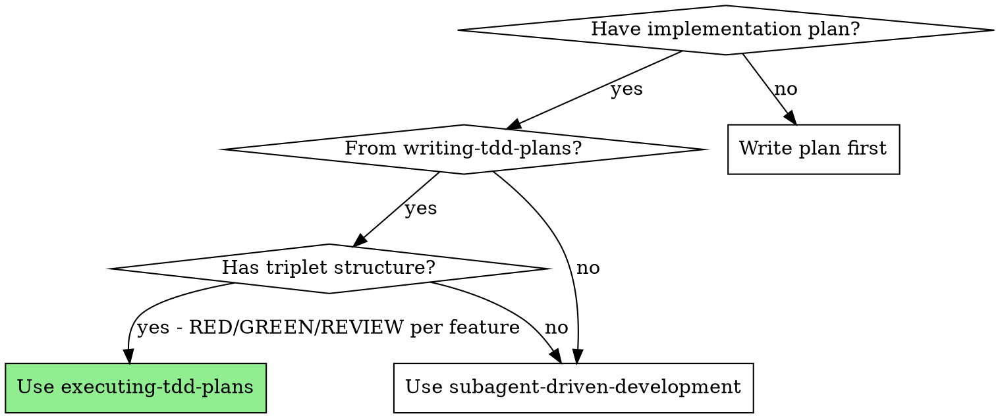
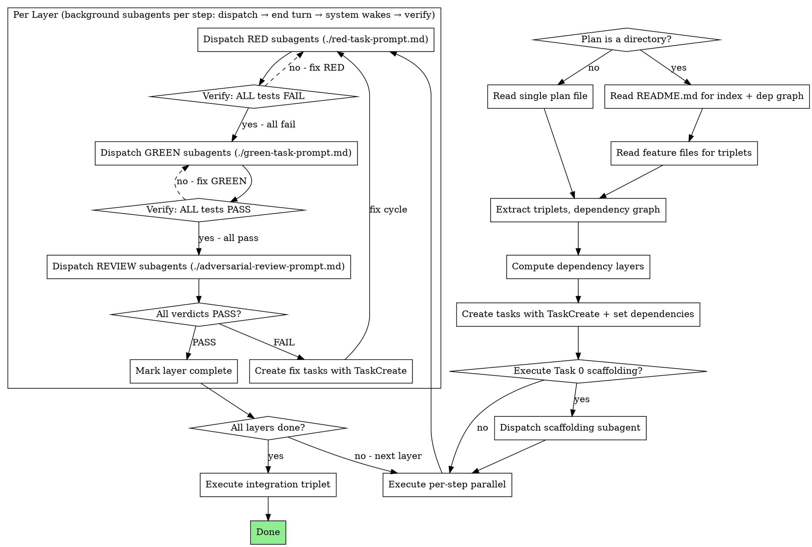

# Executing TDD Plans

## Overview

Execute TDD plans using parallel per-step background subagent architecture with task tracking. Fresh background subagent per task, triplet structure enforced, progress tracked via TaskCreate/TaskUpdate/TaskList.

**Core principle:** Always dispatch background subagents (`run_in_background: true`). Independent triplets in a dependency layer execute in parallel per step. The triplet (RED → GREEN → REVIEW) is always sequential internally. Dispatch background agents → end turn → system wakes you → verify → next step. All progress is tracked with task tools.

**Announce at start:** "I'm using the executing-tdd-plans skill to execute this plan."

## When to Use



## The Process



## Step 1: Analyze the Plan

Plans come in two formats. Detect which one you have:

### Single-file plan (a `.md` file)

Read the plan file and extract everything from it.

### Multi-file plan (a directory)

The directory follows this structure:

```
docs/plans/{plan-name}/
  README.md                    # Header, dependency graph, file index, execution instructions
  task-0-scaffolding.md        # Task 0 (if present)
  feature-1-{name}.md          # Triplet: RED/GREEN/REVIEW for this feature
  feature-2-{name}.md          # Triplet: RED/GREEN/REVIEW for this feature
  ...
  integration.md               # Integration triplet
```

**Reading order:**
1. Read `README.md` first — it contains the **Plan Files** index table (mapping each file to its feature and dependencies) and the dependency graph
2. Read `task-0-scaffolding.md` if listed in the index
3. Read each `feature-N-*.md` file — each contains the complete triplet (N.1 RED, N.2 GREEN, N.3 REVIEW) for that feature
4. Read `integration.md` for the final integration triplet

### From either format, extract:

1. **Task 0 (scaffolding)** — if present, must run first before any triplets
2. **Feature triplets** — each group of N.1 (RED), N.2 (GREEN), N.3 (REVIEW)
3. **Integration triplet** — final triplet, depends on all features
4. **Dependency graph** — from the plan's "Execution Instructions" or explicit graph (in multi-file plans, this is in README.md)

### Compute Dependency Layers

From the dependency graph, group triplets into layers:

- **Layer 0:** Triplets with no dependencies (can start immediately)
- **Layer 1:** Triplets depending only on Layer 0 triplets
- **Layer N:** Triplets depending only on completed layers

**Example:**

```
Plan: Features A, B, C, D
Dependencies: C depends on A, D depends on A and B

Layer 0: [A, B]     ← independent, can run in parallel
Layer 1: [C, D]     ← depend on Layer 0
Layer 2: [Integration] ← depends on all
```

## Step 2: Create Tasks

**Do NOT ask the user whether to proceed.** After analyzing the plan, immediately create tasks and begin execution.

Create a task for every step using **TaskCreate**:

1. **Task 0 (if present):** One task for scaffolding
2. **Per feature triplet:** Three tasks each:
   - `RED: Write failing tests for [feature name]`
   - `GREEN: Implement [feature name]`
   - `REVIEW: Adversarial review of [feature name]`
3. **Integration triplet:** Three tasks (RED/GREEN/REVIEW)

Set up dependencies with **TaskUpdate** (`addBlockedBy`):
- Each GREEN task is blockedBy its RED task
- Each REVIEW task is blockedBy its GREEN task
- All Layer N+1 RED tasks are blockedBy all Layer N REVIEW tasks
- Integration RED is blockedBy all feature REVIEW tasks
- If Task 0 exists, all Layer 0 RED tasks are blockedBy Task 0

**Example for Features A (Layer 0), B (Layer 0), C (Layer 1, depends on A):**

```
TaskCreate: "Task 0: Scaffolding"                           → id: 1
TaskCreate: "RED: Write failing tests for Feature A"        → id: 2, blockedBy: [1]
TaskCreate: "GREEN: Implement Feature A"                     → id: 3, blockedBy: [2]
TaskCreate: "REVIEW: Adversarial review of Feature A"        → id: 4, blockedBy: [3]
TaskCreate: "RED: Write failing tests for Feature B"        → id: 5, blockedBy: [1]
TaskCreate: "GREEN: Implement Feature B"                     → id: 6, blockedBy: [5]
TaskCreate: "REVIEW: Adversarial review of Feature B"        → id: 7, blockedBy: [6]
TaskCreate: "RED: Write failing tests for Feature C"        → id: 8, blockedBy: [4]
TaskCreate: "GREEN: Implement Feature C"                     → id: 9, blockedBy: [8]
TaskCreate: "REVIEW: Adversarial review of Feature C"        → id: 10, blockedBy: [9]
TaskCreate: "RED: Write integration tests"                   → id: 11, blockedBy: [4, 7, 10]
TaskCreate: "GREEN: Implement integration"                   → id: 12, blockedBy: [11]
TaskCreate: "REVIEW: Adversarial review of integration"      → id: 13, blockedBy: [12]
```

### Track Progress

Update task status as execution proceeds:
- When starting a step: **TaskUpdate** status → `in_progress`
- When step completes successfully: **TaskUpdate** status → `completed`
- When a review FAILs: **TaskCreate** for fix tasks with appropriate dependencies

## Step 3: Execute

**Critical constraint:** Only the top-level controller has the Task tool for dispatching subagents. Subagents and team members cannot dispatch further subagents. Therefore, **all subagent dispatching is done by the controller directly**.

### Background Subagent Dispatch

**Always dispatch subagents with `run_in_background: true`.** The controller yields after each dispatch and is woken by the system when agents complete.

**Execution loop per step:**
1. **Dispatch:** TaskUpdate tasks → `in_progress`, dispatch all step's subagents with `run_in_background: true` in a single message
2. **End turn:** Output status message and **end your turn** — do NOT continue working
3. **Wake:** System wakes you when all background agents finish
4. **Verify:** Check results against verification gates (see table below)
5. **Advance:** TaskUpdate tasks → `completed`, proceed to next step (go to 1)

```
Task 0 (if present):
  Dispatch scaffolding subagent (run_in_background: true) → end turn
  → System wakes → verify → TaskUpdate completed
→ Layer 0:
  Step 1: TaskUpdate RED tasks → in_progress
          Dispatch RED-A, RED-B (run_in_background: true) → end turn
          → System wakes → verify ALL fail → TaskUpdate RED tasks → completed
  Step 2: TaskUpdate GREEN tasks → in_progress
          Dispatch GREEN-A, GREEN-B (run_in_background: true) → end turn
          → System wakes → verify ALL pass → TaskUpdate GREEN tasks → completed
  Step 3: TaskUpdate REVIEW tasks → in_progress
          Dispatch REVIEW-A, REVIEW-B (run_in_background: true) → end turn
          → System wakes → check verdicts → TaskUpdate REVIEW tasks → completed
→ Layer 1:
  [same pattern for C, D]
→ Integration triplet
```

**Dispatching background subagents:** In a single message, dispatch all independent subagents for the current step with `run_in_background: true`:

```
// All RED subagents for this layer, dispatched in one message
Task("RED: write failing tests for feature A", run_in_background: true)   // red-task-prompt.md
Task("RED: write failing tests for feature B", run_in_background: true)   // red-task-prompt.md
// End turn. System wakes you when both finish.
```

**Why per-step, not per-triplet?** Subagents cannot dispatch sub-subagents (they lack the Task tool). A "triplet runner" subagent would have to do all RED/GREEN/REVIEW work itself, losing fresh context per task. Per-step parallelism preserves the core principle: **one fresh subagent per task**.

### Prompt Templates

For each task, use the corresponding prompt template:
- RED: `./red-task-prompt.md`
- GREEN: `./green-task-prompt.md`
- REVIEW: `./adversarial-review-prompt.md`

Include full task text from the plan in each subagent prompt. Don't make subagents read the plan file.

## Handling FAILs

When an adversarial review verdict is **FAIL:**

1. Read the issues list from the review (Critical / Important / Minor)
2. Critical or Important issues → create a **fix triplet** using **TaskCreate**:
   - Fix.RED: Write tests targeting the specific issues found
   - Fix.GREEN: Implement fixes to pass the new tests AND existing tests
   - Fix.REVIEW: Re-review against original requirements + fix requirements
3. Minor issues only → implementer fixes directly, no full fix triplet needed
4. **Maximum 2 fix cycles per triplet.** If still FAIL after 2 cycles, escalate to user.
5. Do NOT proceed to the next dependency layer until all triplets in the current layer PASS.

## Verification Gates

Quick reference for gates between each task in a triplet:

| After | Must verify | If fails |
|---|---|---|
| RED (N.1) | ALL tests FAIL (no implementation exists yet) | Fix: tests may be importing wrong module or testing existing code |
| GREEN (N.2) | ALL tests PASS (including RED's tests) | Fix: implementation incomplete, dispatch new GREEN subagent |
| REVIEW (N.3) | Verdict = PASS, no Critical/Important issues | Fix: create fix triplet (see Handling FAILs) |
| Fix cycle | Original tests + fix tests all PASS, review PASS | Escalate to user after 2 cycles |

**If RED tests pass immediately:** Something is wrong. Either the tests are testing existing code or importing from the wrong module. Do NOT proceed to GREEN. Diagnose first.

## Common Mistakes

| Mistake | Fix |
|---|---|
| Dispatching foreground subagents (without run_in_background) | Always use `run_in_background: true` — dispatch, end turn, system wakes you |
| Continuing to work after dispatching background agents | End turn immediately — do NOT verify or dispatch more until system wakes you |
| Running triplets sequentially when plan shows independence | Always use parallel per-step execution across dependency layers |
| Skipping dependency analysis entirely | ALWAYS extract layers before creating tasks |
| Using per-triplet runners (they can't dispatch subagents) | Use per-step parallelism — controller dispatches all REDs, then GREENs, then REVIEWs |
| Not creating tasks with TaskCreate | ALWAYS create tasks for every step and track with TaskUpdate |
| Asking user whether to proceed | Do NOT ask — analyze plan, create tasks, and execute immediately |
| Proceeding when RED tests pass | RED tests MUST fail — diagnose the issue |
| Proceeding when GREEN tests fail | GREEN must make ALL tests pass before review |
| Skipping review because "tests pass" | Review is mandatory — it's a separate tracked task |
| Ignoring FAIL verdicts | Create fix triplet with TaskCreate, don't hand-wave issues |
| Running integration before all features done | Integration is always the last layer |
| Making subagents read the plan file | Paste full task text into the subagent prompt |
| Reading all feature files upfront for a multi-file plan | Read README.md first for the index and dep graph, then read feature files as needed per layer |
| Dispatching a "triplet runner" to handle RED/GREEN/REVIEW | Subagents can't dispatch sub-subagents — controller must dispatch each step directly |
| Dispatching parallel triplets that share files | Check file scopes — parallel triplets must touch different files |

## Red Flags

**Never:**
- Dispatch foreground subagents — always use `run_in_background: true`
- Continue working after dispatching background agents — end turn and wait for system wake
- Skip the dependency analysis (always analyze dependency graph first)
- Combine RED and GREEN into one subagent dispatch
- Skip the REVIEW task ("tests pass, move on")
- Proceed to next layer with FAIL verdicts in current layer
- Run integration before ALL feature triplets complete
- More than 2 fix cycles without escalating to user
- Start implementation on main/master without explicit user consent
- Dispatch parallel subagents that modify overlapping files
- Let the controller execute tasks directly (always fresh subagent per task)
- Dispatch a "triplet runner" subagent to manage RED/GREEN/REVIEW (subagents lack the Task tool — they can't dispatch sub-subagents)
- Ask the user whether to proceed (analyze, create tasks, execute immediately)
- Skip creating tasks with TaskCreate/TaskUpdate (all progress must be tracked)

## Integration

**Input from:** writing-tdd-plans (creates the plan this skill executes)
