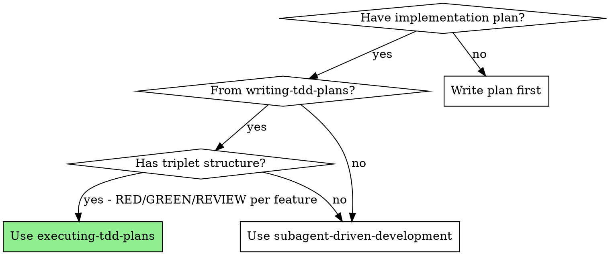
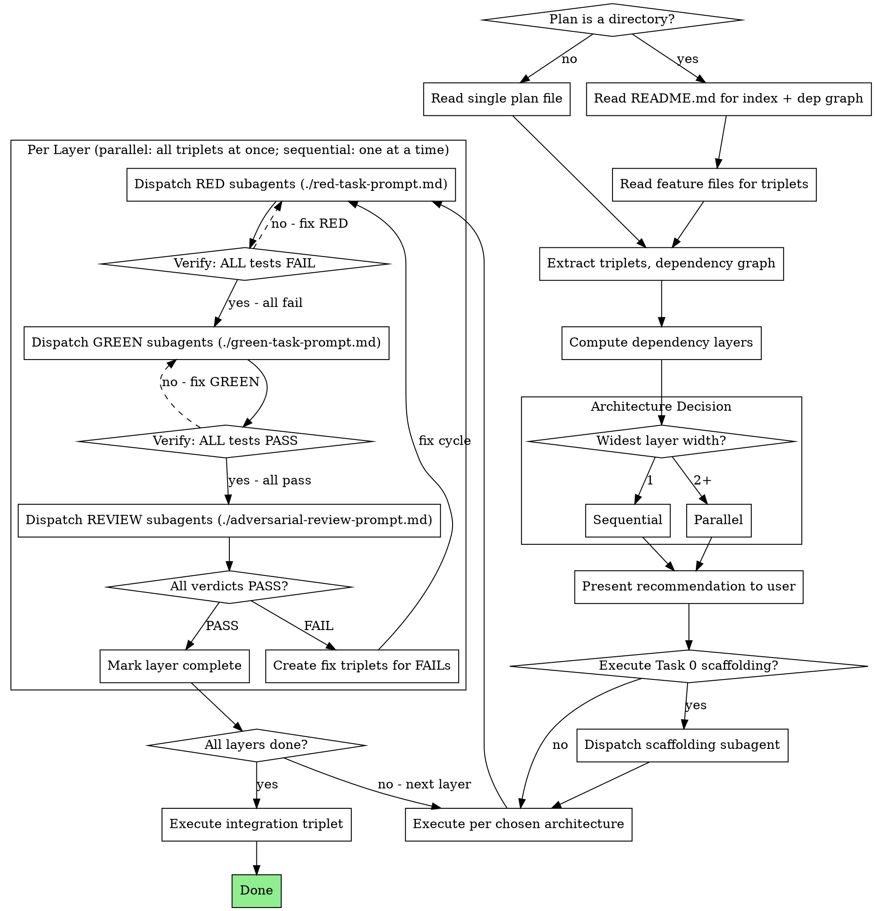

# Executing TDD Plans

## Overview

Execute TDD plans by analyzing their dependency graph and choosing the optimal subagent architecture. Fresh subagent per task, triplet structure enforced.

**Core principle:** The plan's dependency graph determines the architecture. Independent triplets run in parallel; dependent triplets run sequentially. The triplet (RED → GREEN → REVIEW) is always sequential internally.

**Announce at start:** "I'm using the executing-tdd-plans skill to execute this plan."

## When to Use



## The Process



## Step 1: Analyze the Plan

Plans come in two formats. Detect which one you have:

### Single-file plan (a `.md` file)

Read the plan file and extract everything from it.

### Multi-file plan (a directory)

The directory follows this structure:

```
docs/plans/{plan-name}/
  README.md                    # Header, dependency graph, file index, execution instructions
  task-0-scaffolding.md        # Task 0 (if present)
  feature-1-{name}.md          # Triplet: RED/GREEN/REVIEW for this feature
  feature-2-{name}.md          # Triplet: RED/GREEN/REVIEW for this feature
  ...
  integration.md               # Integration triplet
```

**Reading order:**
1. Read `README.md` first — it contains the **Plan Files** index table (mapping each file to its feature and dependencies) and the dependency graph
2. Read `task-0-scaffolding.md` if listed in the index
3. Read each `feature-N-*.md` file — each contains the complete triplet (N.1 RED, N.2 GREEN, N.3 REVIEW) for that feature
4. Read `integration.md` for the final integration triplet

### From either format, extract:

1. **Task 0 (scaffolding)** — if present, must run first before any triplets
2. **Feature triplets** — each group of N.1 (RED), N.2 (GREEN), N.3 (REVIEW)
3. **Integration triplet** — final triplet, depends on all features
4. **Dependency graph** — from the plan's "Execution Instructions" or explicit graph (in multi-file plans, this is in README.md)

### Compute Dependency Layers

From the dependency graph, group triplets into layers:

- **Layer 0:** Triplets with no dependencies (can start immediately)
- **Layer 1:** Triplets depending only on Layer 0 triplets
- **Layer N:** Triplets depending only on completed layers

**Example:**

```
Plan: Features A, B, C, D
Dependencies: C depends on A, D depends on A and B

Layer 0: [A, B]     ← independent, can run in parallel
Layer 1: [C, D]     ← depend on Layer 0
Layer 2: [Integration] ← depends on all
```

**Widest layer** = max triplets in any layer. This determines the architecture.

## Step 2: Choose Architecture

| Plan Shape | Mode | When |
|---|---|---|
| Linear chain | **Sequential** | Widest layer = 1 triplet |
| Any parallelism | **Parallel** | Widest layer = 2+ triplets |

Present recommendation before executing:

```
Plan analysis:
- [N] feature triplets + Task 0 scaffolding + integration
- Dependency layers: Layer 0 [A, B], Layer 1 [C, D], Layer 2 [Integration]
- Widest layer: [M] independent triplets
- Recommended architecture: [Sequential / Parallel]

Proceed?
```

## Step 3: Execute

**Critical constraint:** Only the top-level controller has the Task tool for dispatching subagents. Subagents and team members cannot dispatch further subagents. Therefore, **all subagent dispatching is done by the controller directly**.

### Sequential Mode

Controller dispatches one subagent at a time. One triplet completes fully before the next starts.

```
Task 0 (if present)
→ Triplet 1: RED subagent → verify → GREEN subagent → verify → REVIEW subagent
→ Triplet 2: RED subagent → verify → GREEN subagent → verify → REVIEW subagent
→ ...
→ Integration triplet
```

### Parallel Mode (Per-Step Parallelism)

Controller processes dependency layers. Within each layer, dispatch **all subagents for the same step in parallel**, then verify, then move to the next step.

```
Task 0 (if present)
→ Layer 0:
  Step 1: Dispatch RED-A, RED-B subagents in parallel → wait → verify ALL fail
  Step 2: Dispatch GREEN-A, GREEN-B subagents in parallel → wait → verify ALL pass
  Step 3: Dispatch REVIEW-A, REVIEW-B subagents in parallel → wait → check verdicts
→ Layer 1:
  Step 1: Dispatch RED-C, RED-D in parallel → wait → verify
  Step 2: Dispatch GREEN-C, GREEN-D in parallel → wait → verify
  Step 3: Dispatch REVIEW-C, REVIEW-D in parallel → wait → check
→ Integration triplet
```

**Dispatching parallel subagents:** In a single message, dispatch all independent subagents for the current step simultaneously:

```
// All RED subagents for this layer, dispatched in one message
Task("RED: write failing tests for feature A")   // red-task-prompt.md
Task("RED: write failing tests for feature B")   // red-task-prompt.md
// Both run concurrently, controller waits for all to return
```

**Why per-step, not per-triplet?** Subagents cannot dispatch sub-subagents (they lack the Task tool). A "triplet runner" subagent would have to do all RED/GREEN/REVIEW work itself, losing fresh context per task. Per-step parallelism preserves the core principle: **one fresh subagent per task**.

### Both Modes: Prompt Templates

For each task, use the corresponding prompt template:
- RED: `./red-task-prompt.md`
- GREEN: `./green-task-prompt.md`
- REVIEW: `./adversarial-review-prompt.md`

Include full task text from the plan in each subagent prompt. Don't make subagents read the plan file.

## Handling FAILs

When an adversarial review verdict is **FAIL:**

1. Read the issues list from the review (Critical / Important / Minor)
2. Critical or Important issues → create a **fix triplet:**
   - Fix.RED: Write tests targeting the specific issues found
   - Fix.GREEN: Implement fixes to pass the new tests AND existing tests
   - Fix.REVIEW: Re-review against original requirements + fix requirements
3. Minor issues only → implementer fixes directly, no full fix triplet needed
4. **Maximum 2 fix cycles per triplet.** If still FAIL after 2 cycles, escalate to user.
5. Do NOT proceed to the next dependency layer until all triplets in the current layer PASS.

## Verification Gates

Quick reference for gates between each task in a triplet:

| After | Must verify | If fails |
|---|---|---|
| RED (N.1) | ALL tests FAIL (no implementation exists yet) | Fix: tests may be importing wrong module or testing existing code |
| GREEN (N.2) | ALL tests PASS (including RED's tests) | Fix: implementation incomplete, dispatch new GREEN subagent |
| REVIEW (N.3) | Verdict = PASS, no Critical/Important issues | Fix: create fix triplet (see Handling FAILs) |
| Fix cycle | Original tests + fix tests all PASS, review PASS | Escalate to user after 2 cycles |

**If RED tests pass immediately:** Something is wrong. Either the tests are testing existing code or importing from the wrong module. Do NOT proceed to GREEN. Diagnose first.

## Common Mistakes

| Mistake | Fix |
|---|---|
| Running everything sequentially when plan shows independence | Analyze dependency graph, compute layers, use parallel mode |
| Skipping dependency analysis entirely | ALWAYS extract layers before choosing architecture |
| Using per-triplet runners (they can't dispatch subagents) | Use per-step parallelism — controller dispatches all REDs, then GREENs, then REVIEWs |
| Proceeding when RED tests pass | RED tests MUST fail — diagnose the issue |
| Proceeding when GREEN tests fail | GREEN must make ALL tests pass before review |
| Skipping review because "tests pass" | Review is mandatory — it's a separate tracked task |
| Ignoring FAIL verdicts | Create fix triplet, don't hand-wave issues |
| Running integration before all features done | Integration is always the last layer |
| Making subagents read the plan file | Paste full task text into the subagent prompt |
| Reading all feature files upfront for a multi-file plan | Read README.md first for the index and dep graph, then read feature files as needed per layer |
| Not presenting architecture recommendation | Always get user confirmation before executing |
| Dispatching a "triplet runner" to handle RED/GREEN/REVIEW | Subagents can't dispatch sub-subagents — controller must dispatch each step directly |
| Dispatching parallel triplets that share files | Check file scopes — parallel triplets must touch different files |

## Red Flags

**Never:**
- Skip the architecture analysis (always analyze dependency graph first)
- Combine RED and GREEN into one subagent dispatch
- Skip the REVIEW task ("tests pass, move on")
- Proceed to next layer with FAIL verdicts in current layer
- Run integration before ALL feature triplets complete
- More than 2 fix cycles without escalating to user
- Start implementation on main/master without explicit user consent
- Dispatch parallel subagents that modify overlapping files
- Let the controller execute tasks directly (always fresh subagent per task)
- Dispatch a "triplet runner" subagent to manage RED/GREEN/REVIEW (subagents lack the Task tool — they can't dispatch sub-subagents)

## Integration

**Input from:** writing-tdd-plans (creates the plan this skill executes)
