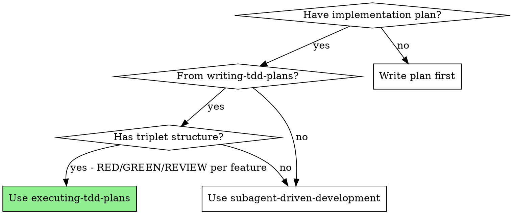
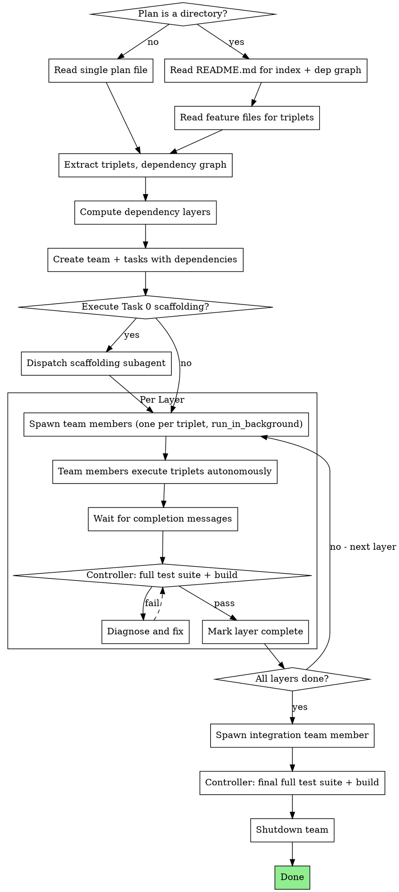

# Executing TDD Plans

## Overview

Execute TDD plans using a team-based architecture: one team member per triplet, each dispatching fresh subagents for RED/GREEN/REVIEW tasks. Progress tracked via TaskCreate/TaskUpdate/TaskList.

**Core principle:** Create a team and spawn one team member per triplet. Each team member autonomously executes RED → GREEN → REVIEW by dispatching fresh subagents (foreground, blocking). Independent triplets in a layer run in parallel via concurrent team members. The controller manages layer transitions and full-suite verification between layers.

**Announce at start:** "I'm using the executing-tdd-plans skill to execute this plan."

## When to Use



## The Process



## Step 1: Analyze the Plan

Plans come in two formats. Detect which one you have:

### Single-file plan (a `.md` file)

Read the plan file and extract everything from it.

### Multi-file plan (a directory)

The directory follows this structure:

```
docs/plans/{plan-name}/
  README.md                    # Header, dependency graph, file index, execution instructions
  task-0-scaffolding.md        # Task 0 (if present)
  feature-1-{name}.md          # Triplet: RED/GREEN/REVIEW for this feature
  feature-2-{name}.md          # Triplet: RED/GREEN/REVIEW for this feature
  ...
  integration.md               # Integration triplet
```

**Reading order:**
1. Read `README.md` first — it contains the **Plan Files** index table (mapping each file to its feature and dependencies) and the dependency graph
2. Read `task-0-scaffolding.md` if listed in the index
3. Read each `feature-N-*.md` file — each contains the complete triplet (N.1 RED, N.2 GREEN, N.3 REVIEW) for that feature
4. Read `integration.md` for the final integration triplet

### From either format, extract:

1. **Task 0 (scaffolding)** — if present, must run first before any triplets
2. **Feature triplets** — each group of N.1 (RED), N.2 (GREEN), N.3 (REVIEW)
3. **Integration triplet** — final triplet, depends on all features
4. **Dependency graph** — from the plan's "Execution Instructions" or explicit graph (in multi-file plans, this is in README.md)

### Compute Dependency Layers

From the dependency graph, group triplets into layers:

- **Layer 0:** Triplets with no dependencies (can start immediately)
- **Layer 1:** Triplets depending only on Layer 0 triplets
- **Layer N:** Triplets depending only on completed layers

**Example:**

```
Plan: Features A, B, C, D
Dependencies: C depends on A, D depends on A and B

Layer 0: [A, B]     ← independent, can run in parallel
Layer 1: [C, D]     ← depend on Layer 0
Layer 2: [Integration] ← depends on all
```

## Step 2: Create Tasks and Team

**Do NOT ask the user whether to proceed.** After analyzing the plan, immediately create tasks, create the team, and begin execution.

### Create Team

```
TeamCreate:
  team_name: "tdd-{plan-name}"
  description: "Executing TDD plan: {plan-name}"
```

After creating the team, read the team config (check `~/.claude/teams/tdd-{plan-name}/config.json` or `~/.claude/teams/tdd-{plan-name}.json`) to find your own member name. Include this name in team member prompts as the report-to recipient.

### Create Tasks

Create a task for every step using **TaskCreate**:

1. **Task 0 (if present):** One task for scaffolding
2. **Per feature triplet:** Three tasks each:
   - `RED: Write failing tests for [feature name]`
   - `GREEN: Implement [feature name]`
   - `REVIEW: Adversarial review of [feature name]`
3. **Integration triplet:** Three tasks (RED/GREEN/REVIEW)

Set up dependencies with **TaskUpdate** (`addBlockedBy`):
- Each GREEN task is blockedBy its RED task
- Each REVIEW task is blockedBy its GREEN task
- All Layer N+1 RED tasks are blockedBy all Layer N REVIEW tasks
- Integration RED is blockedBy all feature REVIEW tasks
- If Task 0 exists, all Layer 0 RED tasks are blockedBy Task 0

**Example for Features A (Layer 0), B (Layer 0), C (Layer 1, depends on A):**

```
TaskCreate: "Task 0: Scaffolding"                           → id: 1
TaskCreate: "RED: Write failing tests for Feature A"        → id: 2, blockedBy: [1]
TaskCreate: "GREEN: Implement Feature A"                     → id: 3, blockedBy: [2]
TaskCreate: "REVIEW: Adversarial review of Feature A"        → id: 4, blockedBy: [3]
TaskCreate: "RED: Write failing tests for Feature B"        → id: 5, blockedBy: [1]
TaskCreate: "GREEN: Implement Feature B"                     → id: 6, blockedBy: [5]
TaskCreate: "REVIEW: Adversarial review of Feature B"        → id: 7, blockedBy: [6]
TaskCreate: "RED: Write failing tests for Feature C"        → id: 8, blockedBy: [4]
TaskCreate: "GREEN: Implement Feature C"                     → id: 9, blockedBy: [8]
TaskCreate: "REVIEW: Adversarial review of Feature C"        → id: 10, blockedBy: [9]
TaskCreate: "RED: Write integration tests"                   → id: 11, blockedBy: [4, 7, 10]
TaskCreate: "GREEN: Implement integration"                   → id: 12, blockedBy: [11]
TaskCreate: "REVIEW: Adversarial review of integration"      → id: 13, blockedBy: [12]
```

## Step 3: Execute

### Task 0: Scaffolding (if present)

Dispatch a regular background subagent (no team member needed):
```
Task(general-purpose, run_in_background: true):
  "Execute scaffolding task: [task 0 text]"
```
Wait for completion, verify, TaskUpdate → completed.

### Layer Execution

For each layer, spawn one team member per triplet. All team members in a layer run in parallel.

**Spawning team members:** In a single message, spawn all team members for the current layer:

```
// Layer 0: Features A and B are independent
Task(general-purpose, team_name: "tdd-{plan}", name: "triplet-a", run_in_background: true):
  [triplet runner prompt for Feature A — see ./triplet-runner-prompt.md]

Task(general-purpose, team_name: "tdd-{plan}", name: "triplet-b", run_in_background: true):
  [triplet runner prompt for Feature B — see ./triplet-runner-prompt.md]

// End turn. Team members execute autonomously.
```

**Controller workflow per layer:**
1. **Spawn:** Dispatch all team members for this layer (one per triplet) with `run_in_background: true`
2. **Wait:** End turn — team members execute triplets autonomously
3. **Collect:** Team members send completion messages via SendMessage. Wait for all to report.
4. **Verify:** Run full test suite + full project build
5. **Advance:** If all pass, proceed to next layer. If failures, diagnose which feature.

**Ignore team member idle notifications.** Team members may go idle briefly during execution — this is normal. Only act on explicit completion messages (SendMessage from team members).

**Counting completions:** Track how many team members you spawned for the layer. Only proceed to full-suite verification after receiving completion messages from ALL of them.

### Integration

After all feature layers complete, spawn one team member for the integration triplet:

```
Task(general-purpose, team_name: "tdd-{plan}", name: "triplet-integration", run_in_background: true):
  [triplet runner prompt for Integration — see ./triplet-runner-prompt.md]
```

After integration completes, run final full test suite + build.

### Shutdown

After all work is complete:
1. Send `shutdown_request` to all team members
2. `TeamDelete` to clean up

## Team Member Workflow

Each team member executes a complete triplet by dispatching fresh foreground subagents (blocking calls). See `./triplet-runner-prompt.md` for the full prompt template.

**Team member workflow:**

```
1. TaskUpdate RED → in_progress
2. Dispatch RED subagent (foreground) → blocks until done → get result
3. Verify RED: scoped tests must ALL FAIL
4. TaskUpdate RED → completed

5. TaskUpdate GREEN → in_progress
6. Dispatch GREEN subagent (foreground) → blocks until done → get result
7. Verify GREEN: scoped tests must ALL PASS
8. TaskUpdate GREEN → completed

9. TaskUpdate REVIEW → in_progress
10. Dispatch REVIEW subagent (foreground) → blocks until done → get result
11. Check verdict → if FAIL, handle fix cycle
12. TaskUpdate REVIEW → completed

13. SendMessage to controller: result
```

Since subagents run foreground (blocking), the team member executes the entire triplet in a single continuous flow — no idle/wake cycles between steps.

**Fix cycles:** If REVIEW fails, team member creates fix triplet tasks and dispatches fix subagents (same pattern). Max 2 fix cycles before reporting FAILURE to controller.

## Prompt Templates

For each task type, use the corresponding prompt template:
- RED subagent: `./red-task-prompt.md`
- GREEN subagent: `./green-task-prompt.md`
- REVIEW subagent: `./adversarial-review-prompt.md`
- Triplet runner (team member): `./triplet-runner-prompt.md`

The team member reads the RED/GREEN/REVIEW templates to construct its subagent prompts. Include full task text from the plan in each team member prompt — don't make team members read the plan file.

**Skill directory path:** Include the absolute path to this skill's directory in each team member prompt so it can find the prompt template files (red-task-prompt.md, green-task-prompt.md, adversarial-review-prompt.md). Use the path from which you loaded this skill.

## Subagent Response Format

Subagents return minimal responses to conserve context:
- **RED / GREEN:** `SUCCESS` or `FAILURE <single-line reason>`
- **REVIEW (pass):** `SUCCESS`
- **REVIEW (fail):** `FAILURE` followed by one line per Critical/Important issue with file:line and suggested fix

## Build Conflict Prevention

When multiple team members execute in parallel (same layer), they share the workspace. Global commands — full test suite, project-wide build — pick up other team members' in-progress changes, causing spurious failures.

**Rules for team members and their subagents:**
1. **Scoped test runs only:** Run ONLY your own test file(s), never the full test suite (e.g., `npx jest tests/my-feature.test.ts` not `npm test`)
2. **No global builds:** Do NOT run `npm run build`, `tsc`, or other workspace-wide compilation
3. **Targeted commits:** Commit only your specific files — never `git add .` or `git add -A`

**Controller responsibilities between layers:**
1. Run the **full test suite** after all team members in a layer complete
2. Run a **full project build** if the project requires compilation
3. If the full suite/build fails, diagnose which feature caused the issue

## Handling FAILs

The **team member** handles fix cycles autonomously:

1. Read the issues from the FAILURE response (one line per Critical/Important issue)
2. Create a **fix triplet** using **TaskCreate**:
   - Fix.RED: Write tests targeting the specific issues found
   - Fix.GREEN: Implement fixes to pass the new tests AND existing tests
   - Fix.REVIEW: Re-review against original requirements + fix requirements
3. Dispatch fix subagents (same pattern: RED → verify → GREEN → verify → REVIEW)
4. **Maximum 2 fix cycles per triplet.** If still FAIL after 2 cycles, report FAILURE to controller via SendMessage.

The controller does NOT handle fix cycles — team members are autonomous. The controller only intervenes if a team member reports FAILURE (escalate to user).

## Verification Gates

| After | Team member verifies (scoped) | Controller verifies (between layers) | If fails |
|---|---|---|---|
| RED (N.1) | Own test file(s) ALL FAIL | — | Fix: tests may be importing wrong module or testing existing code |
| GREEN (N.2) | Own test file(s) ALL PASS | — | Fix: dispatch new GREEN subagent |
| REVIEW (N.3) | Verdict = PASS, own tests pass | — | Fix: team member handles fix cycle |
| Layer complete | — | Full test suite + full build | Diagnose which feature broke |
| Integration | — | Full test suite + final build | Fix or escalate to user |

**If RED tests pass immediately:** Something is wrong. Team member should diagnose before proceeding to GREEN.

## Common Mistakes

| Mistake | Fix |
|---|---|
| Spawning team members without creating a team first | Always create team with TeamCreate before spawning members |
| Controller handling fix cycles | Team members handle fix cycles autonomously — controller only manages layers |
| Acting on team member idle notifications | Only react to explicit SendMessage completion messages |
| Spawning team members sequentially instead of parallel | Spawn all team members for a layer in a single message |
| Skipping full test suite between layers | Controller MUST run full suite + build between layers |
| Team member running full test suite | Team members and their subagents run ONLY scoped tests |
| Team member running global builds | No global builds in team members or their subagents |
| Using plain subagents instead of team members for triplets | Team members need the Task tool to dispatch subagents — plain subagents can't |
| Asking user whether to proceed | Do NOT ask — analyze, create team + tasks, execute immediately |
| Making team members read the plan file | Paste full task text into the team member prompt |
| Proceeding when RED tests pass | RED tests MUST fail — team member diagnoses |
| Skipping review because "tests pass" | Review is mandatory — it's a separate tracked task |
| More than 2 fix cycles without reporting | Team member reports FAILURE after 2 fix cycles |
| Running integration before all features done | Integration is always the last layer |
| Dispatching parallel team members for triplets that share files | Check file scopes — parallel triplets must touch different files |
| Not reading team config for controller name | Read config after TeamCreate to get your name for team member prompts |
| Not including build conflict rules in team member prompts | Every team member prompt must include scoped-test and no-global-build constraints |

## Red Flags

**Never:**
- Skip creating a team (team members need the Task tool to dispatch subagents)
- Handle fix cycles in the controller (team members are autonomous)
- React to team member idle notifications (only react to SendMessage)
- Spawn team members without `run_in_background: true`
- Skip full test suite between layers
- Let team members or their subagents run the full test suite or global builds
- Combine RED and GREEN into one subagent
- Skip the REVIEW task ("tests pass, move on")
- Proceed to next layer with FAIL verdicts in current layer
- Run integration before ALL feature triplets complete
- Start implementation on main/master without explicit user consent
- Dispatch parallel team members for triplets that modify overlapping files
- Let the controller execute tasks directly (always team member + fresh subagent)
- Ask the user whether to proceed (analyze, create tasks, execute immediately)
- Skip creating tasks with TaskCreate/TaskUpdate (all progress must be tracked)

## Integration

**Input from:** writing-tdd-plans (creates the plan this skill executes)
