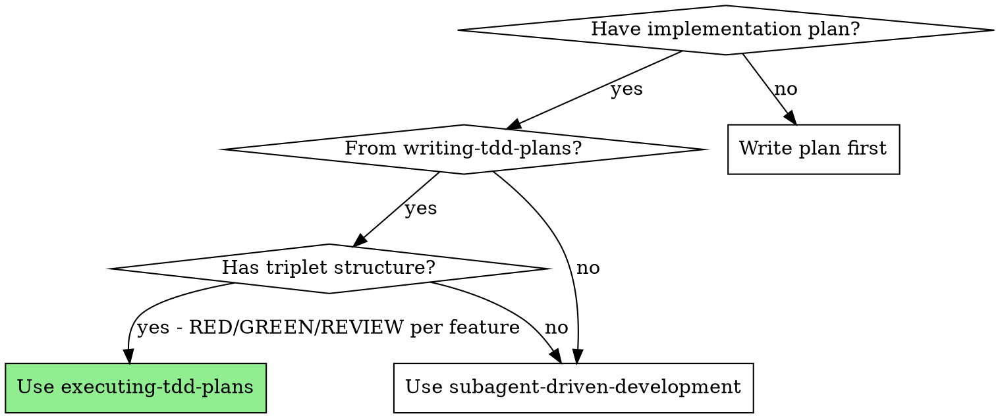
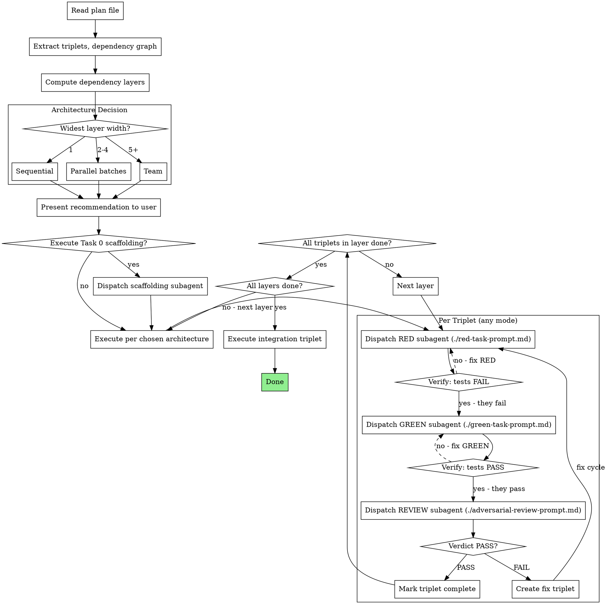
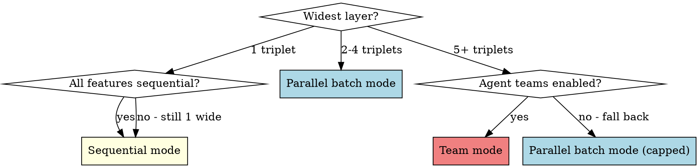

# Executing TDD Plans

## Overview

Execute TDD plans by analyzing their dependency graph and choosing the optimal subagent architecture. Fresh subagent per task, triplet structure enforced.

**Core principle:** The plan's dependency graph determines the architecture. Independent triplets run in parallel; dependent triplets run sequentially. The triplet (RED → GREEN → REVIEW) is always sequential internally.

**Announce at start:** "I'm using the executing-tdd-plans skill to execute this plan."

## When to Use



## The Process



## Step 1: Analyze the Plan

Read the plan file and extract:

1. **Task 0 (scaffolding)** — if present, must run first before any triplets
2. **Feature triplets** — each group of N.1 (RED), N.2 (GREEN), N.3 (REVIEW)
3. **Integration triplet** — final triplet, depends on all features
4. **Dependency graph** — from the plan's "Execution Instructions" or explicit graph

### Compute Dependency Layers

From the dependency graph, group triplets into layers:

- **Layer 0:** Triplets with no dependencies (can start immediately)
- **Layer 1:** Triplets depending only on Layer 0 triplets
- **Layer N:** Triplets depending only on completed layers

**Example:**

```
Plan: Features A, B, C, D
Dependencies: C depends on A, D depends on A and B

Layer 0: [A, B]     ← independent, can run in parallel
Layer 1: [C, D]     ← depend on Layer 0
Layer 2: [Integration] ← depends on all
```

**Widest layer** = max triplets in any layer. This determines the architecture.

## Step 2: Choose Architecture



| Plan Shape | Mode | When |
|---|---|---|
| Linear chain | **Sequential** | Widest layer = 1 triplet |
| Some parallelism | **Parallel batches** | Widest layer = 2-4 triplets |
| Wide graph | **Team** | Widest layer = 5+ triplets (requires agent teams enabled) |

Present recommendation before executing:

```
Plan analysis:
- [N] feature triplets + Task 0 scaffolding + integration
- Dependency layers: Layer 0 [A, B], Layer 1 [C, D], Layer 2 [Integration]
- Widest layer: [M] independent triplets
- Recommended architecture: [Sequential / Parallel batches / Team]

Proceed?
```

## Step 3: Execute

### Sequential Mode

Controller dispatches one subagent at a time. Simplest approach.

```
Task 0 (if present)
→ Triplet 1: RED subagent → GREEN subagent → REVIEW subagent
→ Triplet 2: RED subagent → GREEN subagent → REVIEW subagent
→ ...
→ Integration triplet
```

For each task, use the corresponding prompt template:
- RED: `./red-task-prompt.md`
- GREEN: `./green-task-prompt.md`
- REVIEW: `./adversarial-review-prompt.md`

Include full task text from the plan in each subagent prompt. Don't make subagents read the plan file.

### Parallel Batch Mode

Controller processes dependency layers. Within each layer, dispatch **triplet runners** in parallel — one per independent triplet.

```
Task 0 (if present)
→ Layer 0: dispatch triplet-runner A, triplet-runner B (parallel)
  → Each runner handles RED → GREEN → REVIEW for its triplet
  → Wait for all runners in layer to complete
→ Layer 1: dispatch triplet-runner C, triplet-runner D (parallel)
  → Wait for all
→ Integration triplet
```

Each triplet runner is a Task subagent using `./triplet-runner-prompt.md`. The runner dispatches its own sub-subagents for RED, GREEN, REVIEW (fresh context per task).

**Dispatching parallel runners:**

```
// In a single message, dispatch all independent triplet runners simultaneously
Task("Execute triplet A: [feature]")  // triplet-runner-prompt.md
Task("Execute triplet B: [feature]")  // triplet-runner-prompt.md
// Both run concurrently
```

When all runners in a layer complete, start the next layer.

### Team Mode

For large plans with 5+ independent triplets. Requires `CLAUDE_CODE_EXPERIMENTAL_AGENT_TEAMS=1`.

**Team composition:**

| Agent | Model | Type | Role |
|---|---|---|---|
| Orchestrator | opus | general-purpose | Coordinates layers, manages pipelines |
| Explorer | haiku | Explore | Finds files and patterns for orchestrator |
| Pipeline-1..N | sonnet | general-purpose | Each handles one triplet (RED→GREEN→REVIEW) |

**Lifecycle:**

1. `TeamCreate` with plan name
2. Spawn Explorer — map relevant files from plan
3. Create tasks via `TaskCreate` — one per triplet, with dependencies
4. For each dependency layer, spawn pipeline agents for independent triplets
5. Each pipeline agent dispatches Task subagents for RED → GREEN → REVIEW
6. Pipeline agents report completion or FAIL to orchestrator
7. Orchestrator manages layer progression
8. After all triplets: run integration triplet
9. Shutdown all agents → `TeamDelete`

Pipeline agent template: `./triplet-runner-prompt.md` (same as parallel mode, but within a team context — agent reports to orchestrator via `SendMessage`).

**Token optimization:**
- Explorer is haiku (cheap codebase queries)
- Pipeline agents are sonnet (implementation work)
- Orchestrator is opus (coordination only, never searches directly)
- All agents use silent thinking, minimal output

## Handling FAILs

When an adversarial review verdict is **FAIL:**

1. Read the issues list from the review (Critical / Important / Minor)
2. Critical or Important issues → create a **fix triplet:**
   - Fix.RED: Write tests targeting the specific issues found
   - Fix.GREEN: Implement fixes to pass the new tests AND existing tests
   - Fix.REVIEW: Re-review against original requirements + fix requirements
3. Minor issues only → implementer fixes directly, no full fix triplet needed
4. **Maximum 2 fix cycles per triplet.** If still FAIL after 2 cycles, escalate to user.
5. Do NOT proceed to the next dependency layer until all triplets in the current layer PASS.

## Verification Gates

Quick reference for gates between each task in a triplet:

| After | Must verify | If fails |
|---|---|---|
| RED (N.1) | ALL tests FAIL (no implementation exists yet) | Fix: tests may be importing wrong module or testing existing code |
| GREEN (N.2) | ALL tests PASS (including RED's tests) | Fix: implementation incomplete, dispatch new GREEN subagent |
| REVIEW (N.3) | Verdict = PASS, no Critical/Important issues | Fix: create fix triplet (see Handling FAILs) |
| Fix cycle | Original tests + fix tests all PASS, review PASS | Escalate to user after 2 cycles |

**If RED tests pass immediately:** Something is wrong. Either the tests are testing existing code or importing from the wrong module. Do NOT proceed to GREEN. Diagnose first.

## Model Selection

| Task | Model | Rationale |
|---|---|---|
| Task 0 (scaffolding) | sonnet | Setup work, moderate reasoning |
| RED (test writing) | sonnet | Code generation + requirement interpretation |
| GREEN (implementation) | opus | Standard implementation |
| REVIEW (adversarial) | opus | Judgment, code reading, test writing |
| Triplet runner (parallel) | sonnet | Manages one triplet pipeline |
| Orchestrator (team) | opus | Complex multi-pipeline coordination |
| Explorer (team) | haiku | File finding, cheap queries |

## Common Mistakes

| Mistake | Fix |
|---|---|
| Running everything sequentially when plan shows independence | Analyze dependency graph, compute layers, use parallel mode |
| Skipping dependency analysis entirely | ALWAYS extract layers before choosing architecture |
| Using team mode for 2-3 features | Parallel batches are simpler and sufficient |
| Proceeding when RED tests pass | RED tests MUST fail — diagnose the issue |
| Proceeding when GREEN tests fail | GREEN must make ALL tests pass before review |
| Skipping review because "tests pass" | Review is mandatory — it's a separate tracked task |
| Ignoring FAIL verdicts | Create fix triplet, don't hand-wave issues |
| Running integration before all features done | Integration is always the last layer |
| Making subagents read the plan file | Paste full task text into the subagent prompt |
| Not presenting architecture recommendation | Always get user confirmation before executing |
| Dispatching parallel triplets that share files | Check file scopes — parallel triplets must touch different files |

## Red Flags

**Never:**
- Skip the architecture analysis (always analyze dependency graph first)
- Combine RED and GREEN into one subagent dispatch
- Skip the REVIEW task ("tests pass, move on")
- Proceed to next layer with FAIL verdicts in current layer
- Run integration before ALL feature triplets complete
- More than 2 fix cycles without escalating to user
- Start implementation on main/master without explicit user consent
- Use team mode without `CLAUDE_CODE_EXPERIMENTAL_AGENT_TEAMS` enabled
- Dispatch parallel triplets that modify overlapping files
- Let the controller execute tasks directly (always fresh subagent per task)

## Integration

**Input from:** writing-tdd-plans (creates the plan this skill executes)
**Team mode requires:** `CLAUDE_CODE_EXPERIMENTAL_AGENT_TEAMS=1` in settings
