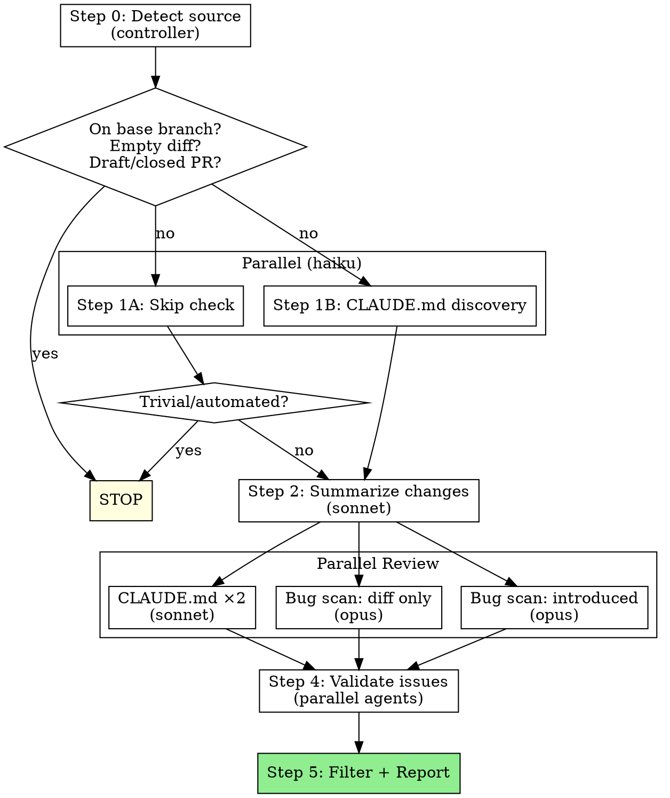

# Reviewing Code

## Overview

Multi-agent code review that auto-detects whether to review a PR or local diff. Produces a detailed report in the terminal and writes it to `docs/reviews/`.

**Core principle:** HIGH SIGNAL ONLY. Flag issues where the code will definitely fail, produce wrong results, or clearly violates documented rules. If you're not certain, don't flag it. False positives erode trust and waste reviewer time.

**Announce at start:** "I'm using the reviewing-code skill to review changes on this branch."

## When to Use

- Reviewing changes before merging or creating a PR
- On-demand code review of current branch
- Validating work before pushing

## Agent Assumptions

**All tools are functional and will work without error.** Do not test tools or make exploratory calls. Every tool call should have a clear purpose. **Make this clear to every subagent you launch.**

## The Process



### Step 0: Source Detection (Controller)

You (the controller) determine the review source directly. Do NOT delegate this to a subagent.

1. Get current branch: `git rev-parse --abbrev-ref HEAD`
2. If on `main` or `master` → **stop** ("Nothing to review — on base branch")
3. Try to detect PR: `gh pr view --json number,title,body,state,isDraft,baseRefName 2>/dev/null`
4. **If PR exists:**
   - Draft → **stop** ("PR is a draft, skipping review")
   - Closed/merged → **stop** ("PR is closed, skipping review")
   - Open → **PR mode**:
     - `DIFF_CMD="gh pr diff <number>"`
     - `TITLE` = PR title
     - `DESCRIPTION` = PR body
     - `BASE_BRANCH` = PR baseRefName
5. **If no PR:**
   - Detect base: `git rev-parse --verify main 2>/dev/null` → `main`, else try `master`
   - **LOCAL mode**:
     - `DIFF_CMD="git diff <base>...HEAD"`
     - `TITLE` = branch name
     - `DESCRIPTION` = output of `git log <base>..HEAD --oneline`
     - `BASE_BRANCH` = detected base
6. Run the diff command. If empty → **stop** ("No changes to review")

Store MODE, DIFF_CMD, TITLE, DESCRIPTION, BASE_BRANCH for use in all subsequent steps.

### Step 1: Pre-flight + Context (2 Haiku Agents, Parallel)

**Agent A — Skip check:**
- Give: TITLE, DESCRIPTION, first 100 lines of diff
- Task: Is this an automated or trivial change that doesn't need code review? (e.g., version bump only, auto-generated lock file only, CI config-only change that is obviously correct)
- Return: SKIP or REVIEW

**Agent B — CLAUDE.md discovery:**
- Task: Get modified file paths from the diff (`DIFF_CMD`), then find all relevant CLAUDE.md files:
  - Root CLAUDE.md (if exists)
  - CLAUDE.md in directories containing modified files
  - CLAUDE.md in parent directories of modified files
- Return: List of CLAUDE.md paths with their contents

If Agent A returns SKIP → **stop**.

### Step 2: Summarize Changes (Sonnet Agent)

- Give: DIFF_CMD, TITLE, DESCRIPTION
- Task: Read the full diff and produce a 3-5 sentence summary of the changes
- Return: Summary text

### Step 3: Parallel Review (4 Agents)

Launch all 4 agents in parallel. Each gets: DIFF_CMD, TITLE, DESCRIPTION, and the HIGH SIGNAL criteria from this skill.

**Agents 1 + 2 — CLAUDE.md Compliance (sonnet):**
- Also give: CLAUDE.md contents from Step 1
- Task: Audit changes for CLAUDE.md compliance
- Only evaluate files against CLAUDE.md files that share a path (same directory or parent)
- Split modified files roughly in half between the two agents

**Agent 3 — Bug Scanner, Diff Only (opus):**
- Task: Scan for obvious bugs focusing ONLY on the diff itself
- Do NOT read extra context outside the diff
- Flag only significant bugs; ignore nitpicks and likely false positives
- Do not flag issues that cannot be validated without context outside the diff

**Agent 4 — Bug Scanner, Introduced Code (opus):**
- Task: Look for problems in the introduced code (security issues, incorrect logic, etc.)
- Only look for issues within the changed code
- MAY read surrounding context to understand the changes

Each agent returns a list of issues. Each issue includes:
- **File path and line range**
- **Description** of the issue
- **Category**: bug, logic error, security, CLAUDE.md violation
- **Reason** it was flagged

### HIGH SIGNAL Criteria

Share this with every review agent.

**DO flag:**
- Code that will fail to compile or parse (syntax errors, type errors, missing imports, unresolved references)
- Code that will definitely produce wrong results regardless of inputs (clear logic errors)
- Clear, unambiguous CLAUDE.md violations where you can quote the exact rule being broken

**Do NOT flag:**
- Code style or quality concerns
- Potential issues that depend on specific inputs or state
- Subjective suggestions or improvements
- Pre-existing issues not introduced in this diff
- Pedantic nitpicks a senior engineer wouldn't flag
- Issues a linter would catch (do not run linter to verify)
- General code quality concerns unless explicitly required in CLAUDE.md
- Issues silenced in code (e.g., lint ignore comments)

**If you are not certain an issue is real, do not flag it.**

### Step 4: Validate Issues (Parallel Agents)

For each issue found in Step 3, launch a validation subagent in parallel:

- Give: DIFF_CMD, TITLE, DESCRIPTION, the specific issue description
- Task: Verify the issue is real with high confidence
  - Example: "variable not defined" → verify it's actually undefined in the code
  - Example: "CLAUDE.md rule violated" → verify the rule is scoped to the file and actually broken
- **Opus** agents for bugs and logic issues
- **Sonnet** agents for CLAUDE.md violations
- Return: VALID or INVALID with reasoning

### Step 5: Filter + Report (Controller)

1. Remove issues marked INVALID
2. Collect remaining validated issues

**Terminal output:**
- If issues found: list each with file, line range, category, and description
- If no issues: "No issues found. Checked for bugs and CLAUDE.md compliance."

**Write review file:**
- `mkdir -p docs/reviews`
- Sanitize branch name (replace `/` with `-`)
- Write to: `docs/reviews/<sanitized-branch>-YYYY-MM-DD.md`

Use this template:

```markdown
# Code Review: <branch-name>

**Date**: YYYY-MM-DD
**Source**: PR #N / Local diff
**Base branch**: <base>
**Reviewer**: Claude (automated)

## Summary

<summary from Step 2>

## Issues Found

### Issue N: <title>
- **Severity**: Critical / Important / Minor
- **Category**: Bug / CLAUDE.md violation / Security / Logic error
- **File**: `path/to/file` (lines X-Y)
- **Description**: <description>
- **Suggested Fix**: <fix>

## Conclusion

<N issues found / No issues found. Checked for bugs and CLAUDE.md compliance.>
```

If no issues were found, replace the "Issues Found" section with: "No issues found."

## Model Selection

| Agent | Model | Rationale |
|---|---|---|
| Skip check | haiku | Simple judgment call |
| CLAUDE.md discovery | haiku | File system search |
| Change summary | sonnet | Moderate reasoning |
| CLAUDE.md compliance (×2) | sonnet | Rule matching |
| Bug scanner - diff only | opus | Deep reasoning needed |
| Bug scanner - introduced code | opus | Deep reasoning needed |
| Issue validation (bugs) | opus | Verification requires deep reasoning |
| Issue validation (CLAUDE.md) | sonnet | Rule verification |

## Common Mistakes

| Mistake | Fix |
|---|---|
| Posting GitHub comments | This skill NEVER posts comments — report only |
| Flagging style/quality issues | Only HIGH SIGNAL: compile failures, clear bugs, explicit CLAUDE.md violations |
| Flagging pre-existing issues | Only flag issues INTRODUCED in this diff |
| Running review agents sequentially | All 4 review agents must run in parallel |
| Skipping issue validation | Every issue must be validated by a separate agent |
| Not writing the MD file | Always write to `docs/reviews/` |
| Delegating source detection to a subagent | Controller handles Step 0 directly |

## Red Flags

**NEVER:**
- Post comments to GitHub (no `gh pr comment`, no inline comments)
- Flag issues you're not certain about
- Skip the validation step for flagged issues
- Review without first detecting the source mode
- Write the review file to a location other than `docs/reviews/`
