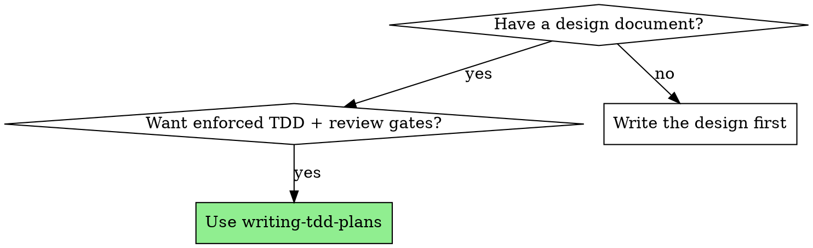
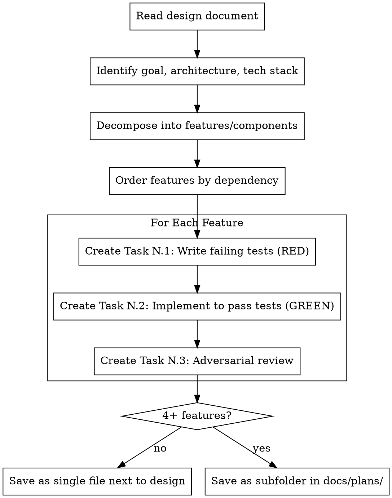

# Writing TDD Plans

## Overview

Transform a design document into an implementation plan where every feature gets three tasks: write failing tests, implement to pass them, adversarial review. Plans are structured for subagent execution — each task is self-contained with full context.

**Core principle:** TDD and review are enforced at the plan level, not left to executor discipline. The plan structure makes skipping tests or reviews impossible because they are separate, tracked tasks.

**Announce at start:** "I'm using the writing-tdd-plans skill to create the implementation plan from the design document."

## When to Use

## The Process

## Plan Output Format

**REQUIRED:** Read `./plan-format.md` before writing any plan. It defines the exact task structure, required fields, commit patterns, and detail level.

Key points (see `plan-format.md` for full templates):
- Every feature gets three tasks: RED (tests) → GREEN (implementation) → REVIEW (adversarial)
- Every task ends with a git commit (incremental progress)
- Tasks must include complete code, exact file paths, verification commands, and verbatim design requirements
- A plan that summarizes what to do instead of specifying what to build is too short

## Decomposition Guidelines

**Read the design document carefully and identify:**

1. **Independent features** — Can be implemented in any order. Their triplets can potentially run in parallel (different subagents working on non-overlapping files).

2. **Dependent features** — Feature B needs Feature A. Order triplets: A.1 → A.2 → A.3 → B.1 → B.2 → B.3.

3. **Shared infrastructure** — If multiple features need the same base (database setup, config, types), create a Task 0 for scaffolding, then triplets for each feature.

### Parallel Execution Safety (MANDATORY)

Independent triplets execute as parallel subagents sharing the same workspace. Two agents editing the same file simultaneously cause merge conflicts, build failures, and spurious test failures.

**Before marking features as independent, analyze file scope overlap:**

1. List the files each feature will create or modify (from the design doc, or by exploring the codebase if the design doesn't list files)
2. If two features modify ANY overlapping files, they are NOT independent — serialize them into different dependency layers
3. Common overlap sources: shared type definitions, barrel exports (index files), config files, utility modules, shared middleware

**Resolution options when overlap is found:**

- **Extract to Task 0:** Move shared file changes into scaffolding (pre-create types, export stubs, config entries). This makes features independent again by eliminating overlap.
- **Serialize:** Place overlapping features in different dependency layers. Feature A runs first, Feature B depends on Feature A's REVIEW completing.

**Prefer Task 0 extraction** when the shared changes are small and mechanical (type additions, re-exports). **Prefer serialization** when the shared file changes are substantial or depend on each feature's implementation.

**Granularity:** Each triplet should be 5-15 minutes of work. If a feature is too large, split it into sub-features, each with its own triplet.

**Dependency graph:** Include a visual dependency graph at the end of the plan showing which triplets can run in parallel and which are sequential. The graph must reflect both logical dependencies AND file-scope overlap — two features are parallel only if they have zero file overlap.

## Common Rationalizations

| Excuse | Reality |
|--------|---------|
| "I'll combine tests and implementation for speed" | Separate tasks enforce TDD. Combined tasks let you write tests-after. |
| "Tests pass, no need for review" | Tests only cover what you thought of. Adversarial review finds what you didn't. |
| "No bugs found, looks good" | Bug-free ≠ correct. Does it actually do what the requirements ask? Review requirements compliance, not just code quality. |
| "Review is overkill for this simple feature" | Simple features have subtle edge cases. Review takes 5 minutes. |
| "I'll write the tests in the implementation task" | That's tests-after with extra steps. The test task must exist separately. |
| "The design is clear enough, I don't need to quote requirements" | Reviewers need verbatim requirements to catch misinterpretations. |
| "Subagents are slow, I'll execute tasks myself" | Fresh subagent context prevents cross-task contamination and shortcuts. |
| "These features are logically independent, so they can run in parallel" | Logical independence ≠ file independence. Check for shared files before marking as parallel. |

## Red Flags

**Never:**
- Merge test and implementation into one task ("write tests and implement")
- Skip the adversarial review ("tests pass, move on")
- Make the review non-adversarial ("looks good" without trying to break it)
- Treat review as only bug-finding — requirements verification is equally important
- Create implementation tasks without preceding test tasks
- Allow a feature to have only 2 of the 3 triplet tasks
- Write vague test tasks ("add tests for feature X") — tests must be concrete code
- Write vague review tasks — review criteria must list specific design requirements
- Write review tasks without minimum additional tests requirement
- Put design requirements in the plan header only — each triplet needs its OWN requirements
- Mark features as parallel without checking for file overlap — shared types, barrel exports, config files cause build conflicts between parallel agents

**The triplet is atomic:** If you can't write all three tasks for a feature, the feature needs to be decomposed further.
