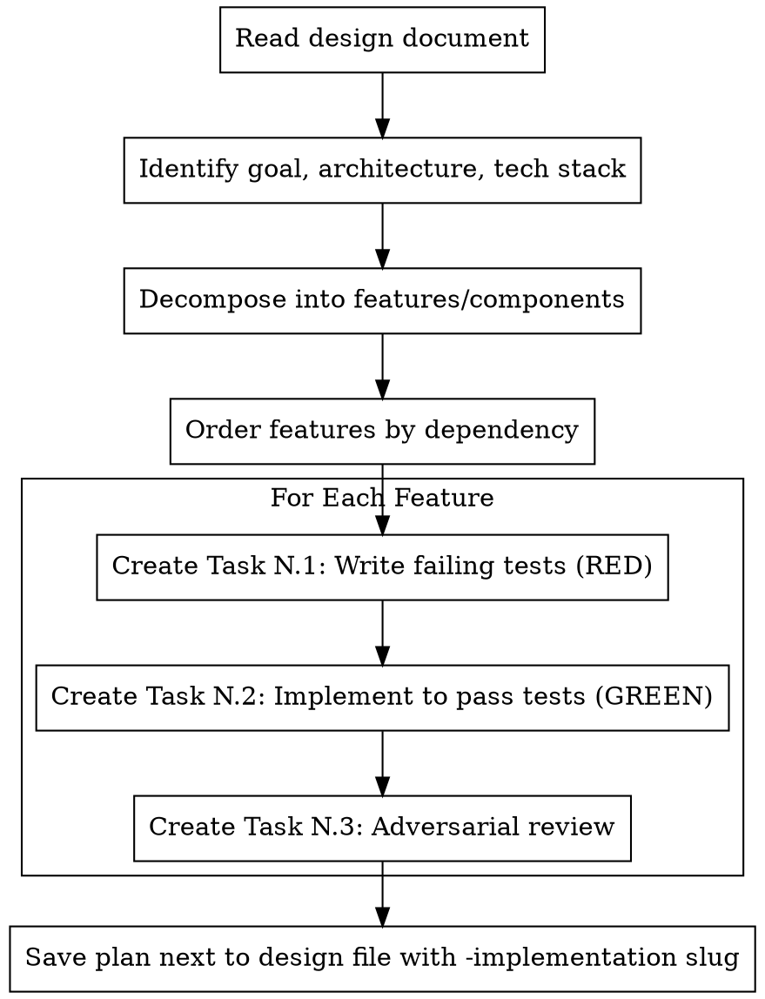

# Writing TDD Plans

## Overview

Transform a design document into an implementation plan where every feature gets three tasks: write failing tests, implement to pass them, adversarial review. Plans are structured for subagent execution — each task is self-contained with full context.

**Core principle:** TDD and review are enforced at the plan level, not left to executor discipline. The plan structure makes skipping tests or reviews impossible because they are separate, tracked tasks.

**Announce at start:** "I'm using the writing-tdd-plans skill to create the implementation plan from the design document."

## When to Use


## The Process



## Plan Document Structure

**Save plans to:** Same directory as the design file, with `-implementation` appended to the filename. Example: `docs/design.md` produces `docs/design-implementation.md`.

### Header

```markdown
# [Feature Name] Implementation Plan

> **For Claude:** Execute this plan using subagents. Dispatch a fresh subagent per task
> using the Task tool (subagent_type: "general-purpose"). Each task is self-contained.
> NEVER skip test or review tasks. They are tracked separately and all must complete.

**Goal:** [One sentence from design]

**Architecture:** [2-3 sentences from design]

**Tech Stack:** [Key technologies/libraries]

**Design Document:** [path/to/design.md]

---
```

### The Triplet: Every Feature Gets Three Tasks

For each feature/component identified in the design:

**Task N.1 — Write Failing Tests (RED)**

```markdown
### Task N.1: Write failing tests for [Feature Name]

**Type:** RED (Test Writing)
**Dispatch as:** Fresh subagent via Task tool
**Depends on:** [previous feature's Task M.3, or none if first]

**Design requirements being tested:**
- [Requirement A from design doc]
- [Requirement B from design doc]
- [Edge case X from design doc]

**Files:**
- Create: `tests/exact/path/to/test_feature.py`

**What to test:**

[Complete test code covering all requirements listed above. Tests MUST fail
because the implementation doesn't exist yet.]

```python
def test_requirement_a():
    """[Requirement A verbatim from design]"""
    result = feature_function(input)
    assert result == expected

def test_edge_case_x():
    """[Edge case X from design]"""
    ...
```

**Verification:**
Run: `[exact test command]`
Expected: ALL tests FAIL (function/module not found)

**Commit:** `git commit -m "test: add failing tests for [feature]"`
```

**Task N.2 — Implement to Pass Tests (GREEN)**

```markdown
### Task N.2: Implement [Feature Name]

**Type:** GREEN (Implementation)
**Dispatch as:** Fresh subagent via Task tool
**Depends on:** Task N.1 must be complete (failing tests must exist)

**Goal:** Write the minimal code to make ALL tests from Task N.1 pass.
Do NOT add functionality beyond what the tests require. YAGNI.

**Files:**
- Create/Modify: `src/exact/path/to/feature.py`
- Reference: `tests/exact/path/to/test_feature.py` (already exists from N.1)

**Implementation:**

[Complete implementation code. Minimal — just enough to pass the tests.]

```python
def feature_function(input):
    # Implementation that satisfies test requirements
    ...
```

**Verification:**
Run: `[exact test command]`
Expected: ALL tests PASS

**Commit:** `git commit -m "feat: implement [feature]"`
```

**Task N.3 — Adversarial Review**

```markdown
### Task N.3: Adversarial review of [Feature Name]

**Type:** REVIEW (Adversarial)
**Dispatch as:** Fresh subagent via Task tool
**Depends on:** Task N.2 must be complete (implementation must exist and tests pass)

**Your role:** You are an adversarial reviewer. Your job is to BREAK this implementation,
not approve it. Assume the implementation is wrong until you prove otherwise.

**Design requirements to verify:**
- [Requirement A from design doc — verbatim]
- [Requirement B from design doc — verbatim]
- [Edge case X from design doc — verbatim]

**Review checklist:**

1. **Design compliance** — Read the implementation and compare against EACH requirement
   listed above. Check line by line. Is anything missing? Misinterpreted? Over-built?

2. **Test adequacy** — Do the tests actually test what they claim? Could the tests pass
   with a WRONG implementation? Write additional tests that expose gaps.

3. **Edge cases** — Try to break it. Think of inputs the tests don't cover.
   Write tests for those inputs and run them.

4. **Error handling** — What happens with invalid input? Null? Empty? Huge? Concurrent?

5. **Integration** — Does it work with the rest of the system? Any assumptions that
   could break when connected to real code?

**You MUST write and run additional tests.** A review without new tests is not adversarial.
Minimum: 3 additional tests targeting gaps, edge cases, or ways the existing tests
could pass with a wrong implementation.

**What to produce:**
- List of issues found (Critical / Important / Minor)
- Additional tests written and their results
- Verdict: PASS (no critical/important issues) or FAIL (issues must be fixed)

**If FAIL:** Create fix tasks (following same triplet: test the fix, implement fix,
re-review). Append them to the plan.

**Commit additional tests:** `git commit -m "test: add adversarial tests for [feature]"`
```

## Special Task Types

### Task 0 — Scaffolding (optional)

If features share infrastructure (database setup, config, project structure, dependency installation), create a **Task 0** before any triplets. This is the only task that doesn't follow the triplet pattern. Keep it minimal — just enough for the first triplet to run.

### Integration Triplet (final)

After all feature triplets pass, add one final triplet for end-to-end integration:
- **N.1:** Write integration tests that exercise multiple features together
- **N.2:** Fix any integration failures (may be a no-op if everything works)
- **N.3:** Final adversarial review against ALL design requirements as a checklist

## Decomposition Guidelines

**Read the design document carefully and identify:**

1. **Independent features** — Can be implemented in any order. Their triplets can potentially run in parallel (different subagents working on non-overlapping files).

2. **Dependent features** — Feature B needs Feature A. Order triplets: A.1 → A.2 → A.3 → B.1 → B.2 → B.3.

3. **Shared infrastructure** — If multiple features need the same base (database setup, config, types), create a Task 0 for scaffolding, then triplets for each feature.

**Granularity:** Each triplet should be 5-15 minutes of work. If a feature is too large, split it into sub-features, each with its own triplet.

**Dependency graph:** Include a visual dependency graph at the end of the plan showing which triplets can run in parallel and which are sequential.

## Subagent Execution Guidance

The plan must include this section after the tasks:

```markdown
## Execution Instructions

**Recommended:** Execute using subagents for fresh context per task.

For each task, dispatch a fresh subagent using the Task tool:
- subagent_type: "general-purpose"
- Provide the FULL task text in the prompt (don't make subagent read this file)
- Include relevant context from earlier tasks (what was built, where files are)

**Execution order:**
- Tasks within a triplet are strictly sequential: N.1 → N.2 → N.3
- Independent triplets MAY run in parallel if they touch different files
- Dependent triplets are sequential: complete triplet N before starting triplet M

**Never:**
- Skip a test-writing task (N.1) — "I'll write tests with the implementation"
- Skip an adversarial review task (N.3) — "The tests already pass, it's fine"
- Combine tasks within a triplet — each is a separate subagent dispatch
- Proceed to N.2 if N.1 tests don't compile/exist
- Proceed to N.3 if N.2 tests don't pass
- Proceed to next triplet if N.3 verdict is FAIL
```

## Common Rationalizations

| Excuse | Reality |
|--------|---------|
| "I'll combine tests and implementation for speed" | Separate tasks enforce TDD. Combined tasks let you write tests-after. |
| "Tests pass, no need for review" | Tests only cover what you thought of. Adversarial review finds what you didn't. |
| "Review is overkill for this simple feature" | Simple features have subtle edge cases. Review takes 5 minutes. |
| "I'll write the tests in the implementation task" | That's tests-after with extra steps. The test task must exist separately. |
| "The design is clear enough, I don't need to quote requirements" | Reviewers need verbatim requirements to catch misinterpretations. |
| "Subagents are slow, I'll execute tasks myself" | Fresh subagent context prevents cross-task contamination and shortcuts. |

## Red Flags

**Never:**
- Merge test and implementation into one task ("write tests and implement")
- Skip the adversarial review ("tests pass, move on")
- Make the review non-adversarial ("looks good" without trying to break it)
- Create implementation tasks without preceding test tasks
- Allow a feature to have only 2 of the 3 triplet tasks
- Write vague test tasks ("add tests for feature X") — tests must be concrete code
- Write vague review tasks — review criteria must list specific design requirements
- Write review tasks without minimum additional tests requirement
- Put design requirements in the plan header only — each triplet needs its OWN requirements

**The triplet is atomic:** If you can't write all three tasks for a feature, the feature needs to be decomposed further.
